<!-- BEGIN REVISED README.MD BLOCK -->


# Simple Chat 

*   [Jump to Table of Contents](#table-of-contents)

## Overview

The **Simple Chat Application** is a comprehensive, web-based platform designed to facilitate secure and context-aware interactions with generative AI models, specifically leveraging **Azure OpenAI**. Its central feature is **Retrieval-Augmented Generation (RAG)**, which significantly enhances AI interactions by allowing users to ground conversations in their own data. Users can upload personal ("Your Workspace") or shared group ("Group Workspaces") documents, which are processed using **Azure AI Document Intelligence**, chunked intelligently based on content type, vectorized via **Azure OpenAI Embeddings**, and indexed into **Azure AI Search** for efficient hybrid retrieval (semantic + keyword).

Built with modularity in mind, the application offers a suite of powerful **optional features** that can be enabled via administrative settings. These include integrating **Azure AI Content Safety** for governance, enabling **Bing Web Search** for real-time data, providing **Image Generation** capabilities (DALL-E), processing **Video** (via Azure Video Indexer) and **Audio** (via Azure Speech Service) files for RAG, implementing **Document Classification** schemes, collecting **User Feedback**, enabling **Conversation Archiving** for compliance, extracting **AI-driven Metadata**, and offering **Enhanced Citations** linked directly to source documents stored in Azure Storage.

The application utilizes **Azure Cosmos DB** for storing conversations, metadata, and settings, and is secured using **Azure Active Directory (Entra ID)** for authentication and fine-grained Role-Based Access Control (RBAC) via App Roles. Designed for enterprise use, it runs reliably on **Azure App Service** and supports deployment in both **Azure Commercial** and **Azure Government** cloud environments, offering a versatile tool for knowledge discovery, content generation, and collaborative AI-powered tasks within a secure, customizable, and Azure-native framework.

##### Screenshot of the Chat UI

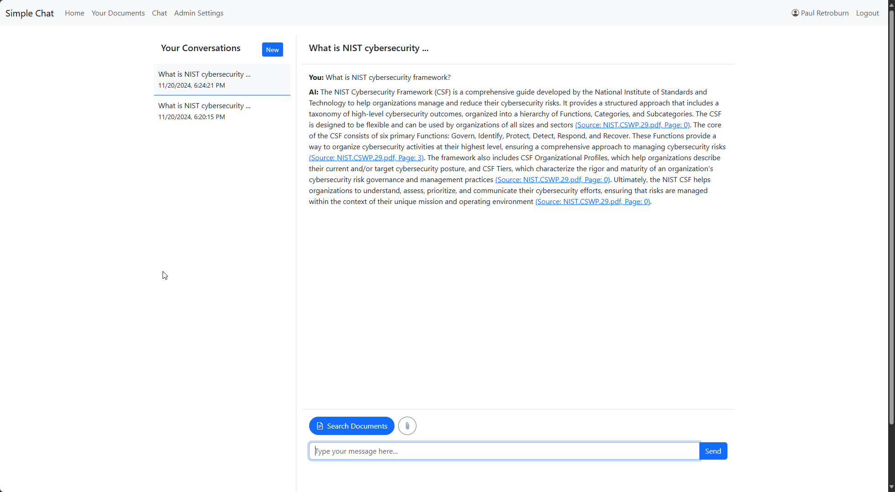

## Features

-   **Chat with AI**: Interact with an AI model based on Azure OpenAI’s GPT models.
-   **RAG with Hybrid Search**: Upload documents and perform hybrid searches (vector + keyword), retrieving relevant information from your files to augment AI responses.
-   **Document Management**: Upload, store, and manage multiple versions of documents—personal ("Your Workspace") or group-level ("Group Workspaces").
-   **Group Management**: Create and join groups to share access to group-specific documents, enabling collaboration with Role-Based Access Control (RBAC).
-   **Ephemeral (Single-Convo) Documents**: Upload temporary documents available only during the current chat session, without persistent storage in Azure AI Search.
-   **Conversation Archiving (Optional)**: Retain copies of user conversations—even after deletion from the UI—in a dedicated Cosmos DB container for audit, compliance, or legal requirements.
-   **Content Safety (Optional)**: Integrate Azure AI Content Safety to review every user message *before* it reaches AI models, search indexes, or image generation services. Enforce custom filters and compliance policies, with an optional `SafetyAdmin` role for viewing violations.
-   **Feedback System (Optional)**: Allow users to rate AI responses (thumbs up/down) and provide contextual comments on negative feedback. Includes user and admin dashboards, governed by an optional `FeedbackAdmin` role.
-   **Bing Web Search (Optional)**: Augment AI responses with live Bing search results, providing up-to-date information. Configurable via Admin Settings.
-   **Image Generation (Optional)**: Enable on-demand image creation using Azure OpenAI's DALL-E models, controlled via Admin Settings.
-   **Video Extraction (Optional)**: Utilize Azure Video Indexer to transcribe speech and perform Optical Character Recognition (OCR) on video frames. Segments are timestamp-chunked for precise retrieval and enhanced citations linking back to the video timecode.
-   **Audio Extraction (Optional)**: Leverage Azure Speech Service to transcribe audio files into timestamped text chunks, making audio content searchable and enabling enhanced citations linked to audio timecodes.
-   **Document Classification (Optional)**: Admins define custom classification types and associated colors. Users tag uploaded documents with these labels, which flow through to AI conversations, providing lineage and insight into data sensitivity or type.
-   **Enhanced Citation (Optional)**: Store processed, chunked files in Azure Storage (organized into user- and document-scoped folders). Display interactive citations in the UI—showing page numbers or timestamps—that link directly to the source document preview.
-   **Metadata Extraction (Optional)**: Apply an AI model (configurable GPT model via Admin Settings) to automatically generate keywords, two-sentence summaries, and infer author/date for uploaded documents. Allows manual override for richer search context.
-   **File Processing Logs (Optional)**: Enable verbose logging for all ingestion pipelines (workspaces and ephemeral chat uploads) to aid in debugging, monitoring, and auditing file processing steps.
-   **Authentication & RBAC**: Secure access via Azure Active Directory (Entra ID) using MSAL. Supports Managed Identities for Azure service authentication, group-based controls, and custom application roles (`Admin`, `User`, `CreateGroup`, `SafetyAdmin`, `FeedbackAdmin`).
-   **Backend Services**:
    -   **Azure Cosmos DB**: Stores conversations, document metadata, user/group information, settings, and optionally archived chats and feedback.
    -   **Azure AI Search**: Powers efficient hybrid search and retrieval over personal and group documents.
    -   **Azure AI Document Intelligence**: Extracts text, layout, and structured data from PDFs, Office files, images, and more during ingestion.

-   **Supported File Types**:
    -   Text: `txt`, `md`, `html`, `json`
    *   Documents: `pdf`, `docx`, `pptx`, `xlsx`, `xls`, `csv`
    *   Images: `jpg`, `jpeg`, `png`, `bmp`, `tiff`, `tif`, `heif` (processed via Document Intelligence OCR)
    *   Video: `mp4`, `mov`, `avi`, `wmv`, `mkv`, `webm` (requires Video Indexer)
    *   Audio: `mp3`, `wav`, `ogg`, `aac`, `flac`, `m4a` (requires Speech Service)

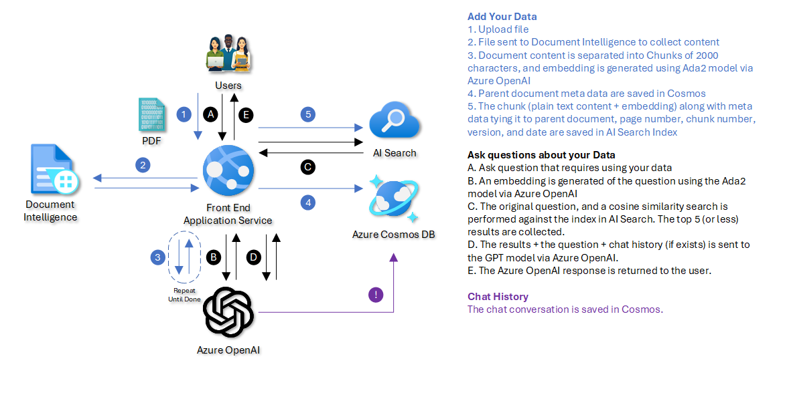

### Why Enable Optional Features?

> <a href="#simple-chat" style="text-decoration: none;">Return to top</a>

#### **Content Safety**

Ensures governance and security by reviewing all user messages before they interact with any service, including AI models, document search, web search, and image generation. This feature allows organizations to enforce custom filters and compliance policies, mitigating risks associated with harmful content or policy violations while maintaining a safe and controlled user experience.

-   **Prevents inappropriate content** from being processed, generated, or retrieved.
-   **Aids compliance** with organizational policies, industry regulations, and responsible AI principles.
-   **Enhances security** by filtering potentially malicious or sensitive queries before they interact with external systems or internal data.
-   **Optional RBAC** (`SafetyAdmin` App Role) restricts access to the Safety Violation Admin View, allowing designated personnel to review flagged content.

#### **Your Workspaces**

**Your Workspace** enhances individual productivity by allowing users to upload, manage, and utilize their personal documents as context for Azure OpenAI. It centralizes important files and prompts, eliminating repetitive uploads and copy-pasting. When enabled, the AI can reference these documents, leading to more relevant, personalized, and contextually accurate responses for tasks like summarizing reports, drafting emails, or brainstorming.

-   **Centralized hub** for personal documents and frequently used prompts, making them easily accessible.
-   **Improved AI context** by enabling Azure OpenAI to "see" user-specific documents, resulting in tailored and accurate responses.
-   **Time-saving** by storing crucial information once for repeated use across multiple chat sessions.

#### **My Groups (includes Group Workspaces)**

Facilitates teamwork by enabling users to create or join groups where documents and prompts can be shared securely. This creates a shared knowledge base, ensuring team members are aligned and can leverage the same information for AI-driven tasks. It reduces redundant explanations and email chains, allowing teams to collaborate efficiently and obtain consistent, AI-generated insights based on collective resources.

-   **Shared knowledge base** ensures team alignment with up-to-date, common resources.
-   **Streamlined collaboration** on documents and prompts, reducing repetitive tasks and communication overhead.
-   **Consistent AI responses** across the team by referencing identical data and prompt sets, minimizing misinformation.
-   **Optional RBAC** (`CreateGroup` App Role) can be enforced to control which users have permission to create new groups.

#### **User Feedback**

Provides a mechanism for end-users to offer direct feedback on the quality and relevance of AI-generated responses. This feedback loop is crucial for monitoring model performance, identifying areas for improvement, and understanding user satisfaction.

-   **Simple rating system** (Thumbs up/down) for quick assessment of AI replies.
-   **Contextual comments** prompted upon a thumbs-down selection, allowing users to specify issues.
-   **User dashboard** for individuals to review their submitted feedback history.
-   **Admin dashboard** for aggregating, reviewing, and acting upon feedback. Access is controlled by **Optional RBAC** (`FeedbackAdmin` App Role).

#### **Conversation Archiving**

Addresses compliance and record-keeping needs by automatically retaining a copy of all user conversations in a separate Cosmos DB container, even if users delete them from their chat history interface.

-   **Dedicated archive container** in Cosmos DB ensures separation from live conversation data.
-   **Post-deletion retention** guarantees that chats removed from the user history remain available for audit or legal discovery.
-   **Supports policy compliance** for regulatory, legal, or internal organizational record-keeping requirements.

#### **Video Extraction (Video Indexer)**

Unlocks the value within video files by using Azure Video Indexer to transcribe spoken words and extract text visible on screen (OCR). This makes video content searchable and citable within the chat application.

-   **Comprehensive text extraction** from both audio tracks (transcription) and visual elements (OCR).
-   **Timestamp-based chunking** segments the extracted text, tagging each chunk with its start time in the video for precise retrieval.
-   **Enhanced citations** in chat responses link directly to the specific time point in the video source.
-   **Integrates seamlessly** with the application's document storage, search, and citation workflow.

#### **Audio Extraction (Speech Service)**

Leverages Azure Speech Service to automatically transcribe audio files, converting spoken content into searchable and citable text.

-   **Accurate transcription** of various uploaded audio formats.
-   **Timestamped text chunks** enable precise linking of citations back to the specific moment in the audio file.
-   **Enhanced citation support** allows users to click a citation and potentially jump to (or reference) the relevant audio timestamp.

#### **Document Classification**

Allows organizations to categorize documents based on sensitivity, type, or other criteria defined by administrators. These classifications persist throughout the application, providing context and aiding governance.

-   **Admin-defined classification types** with customizable labels and visual color-coding.
-   **User-assigned labels** applied during the document upload process.
-   **Classification propagation** ensures that tags associated with referenced documents appear in the chat context, indicating the nature of the source data.
-   **Improved insights** into how different types of documents are being used and referenced in AI interactions.

#### **Enhanced Citation (Storage Account)**

Provides a richer citation experience by storing processed document chunks in Azure Storage and enabling interactive citations that link directly to the source content (e.g., specific page or timestamp).

-   **Structured Azure Storage**: Organizes processed files into user-specific and document-specific folders.
-   **Metadata linkage**: Connects files in Azure Storage with their corresponding document records in Cosmos DB.
-   **Rich UI citations**: Displays page numbers (for documents) or timestamps (for video/audio) alongside document previews within the chat interface.
-   **Direct navigation**: Allows users to click citations to view the original content source, improving transparency and trust.

#### **Metadata Extraction**

Uses AI (a configurable GPT model) to automatically enrich uploaded documents with relevant metadata, improving search relevance and providing better context for AI responses.

-   **Configurable AI model**: Administrators select the GPT model used for extraction via Admin Settings.
-   **Automated generation**: Extracts keywords, creates concise two-sentence summaries, and infers potential author and creation dates.
-   **Improved searchability**: Generated metadata enhances the information available to Azure AI Search, leading to more relevant results.
-   **Manual override**: Users can manually edit or provide their own metadata if the AI-generated content needs correction or refinement.

#### **File Processing Logs**

Enables detailed logging for the entire file ingestion and processing pipeline, assisting administrators and developers in troubleshooting issues, monitoring performance, and auditing activity.

-   **Granular logging**: Captures step-by-step details of document ingestion, chunking, embedding, and indexing processes.
-   **Error diagnostics**: Helps pinpoint failures or bottlenecks in the ingestion or AI-driven extraction steps.
-   **Admin control**: Verbosity can be toggled on or off via Admin Settings, allowing control over logging volume.

## Roadmap

> <a href="#simple-chat" style="text-decoration: none;">Return to top</a>

[Roadmap (as of 5/1/25) · microsoft/simplechat · Discussion #133](https://github.com/microsoft/simplechat/discussions/133)

| Phase                               | Duration    | Key Deliverables                                             |
| :---------------------------------- | :---------- | :----------------------------------------------------------- |
| **Phase 0: Docs & Deployment Prep** | Weeks 1–2   | • Improve documentation & guides<br>• Produce “how-to” videos<br>• Create one-click Terraform/ARM deployment scripts |
| **Phase 1: “N+” Feature Release**   | Weeks 2–6   | • Public workspaces<br>• Horizontal scaling & high availability (Redis Cache)<br>• External AI search index in group & public workspaces |
| **Phase 1.5: Docs Refresh**         | Weeks 6–8   | Update all docs, videos & guides to reflect Phase 1 features and deployment changes |
| **Phase 2: “N+1” Feature Release**  | Weeks 7–11  | • Graph-based RAG support in groups & public workspaces<br>• Database as a data-source (users, groups, public)<br>• API as a data-source (users, groups, public)<br>• Dark mode UI<br>• Conversation vertical-scroll pagination |
| **Phase 2.5: Docs Refresh**         | Weeks 11–13 | Update docs, videos & quick-start guides for Phase 2 additions |
| **Phase 3: “N+2” Feature Release**  | Weeks 12–16 | • MCP server support with admin-defined whitelist<br>• AI agent framework & sample agents |
| **Phase 3.5: Docs Refresh**         | Weeks 16–18 | Produce new tutorials & update reference docs for MCP & agents |
| **Phase 4: “N+3” Feature Release**  | Weeks 17–21 | • Data & workspace management enhancements                   |

## Latest Features

> <a href="#simple-chat" style="text-decoration: none;">Return to top</a>

Below is a summary of recent additions, reflecting the state as of version `v0.212.78`.

### (v0.212.78)

#### New Features

1.  **Audio & Video Processing**
    *   Integrated Azure Speech Service for audio transcription during ingestion.
    *   Integrated Azure Video Indexer for video transcription and OCR.
    *   Added Admin Settings UI for Video Indexer (endpoint, key, locale) and Speech Service (endpoint, key, locale).
    *   Audio transcripts split into ~400-word chunks; Video content uses timestamp-based chunking.
2.  **Multi-Model Support**
    *   Users can select from multiple configured Azure OpenAI GPT deployments at runtime via the chat interface.
    *   Admin Settings dynamically populate the available model list based on configured endpoints (Direct or APIM).
3.  **Advanced Chunking Logic**
    *   **PDF & PPTX**: Page-based chunks via Document Intelligence layout analysis.
    *   **DOC/DOCX**: ~400-word semantic chunks via Document Intelligence.
    *   **Images** (`jpg`/`jpeg`/`png`/`bmp`/`tiff`/`tif`/`heif`): Single chunk containing OCR text from Document Intelligence.
    *   **Plain Text** (`.txt`): ~400-word chunks.
    *   **HTML**: Hierarchical splitting based on H1–H5 tags, preserving table structure, aiming for 600–1200-word chunks.
    *   **Markdown** (`.md`): Header-based splitting (H1-H6), preserving table and code-block integrity, aiming for 600–1200-word chunks.
    *   **JSON**: Recursive splitting using `RecursiveJsonSplitter` (`convert_lists=True`, `max_chunk_size=600`).
    *   **Tabular** (`CSV`/`XLSX`/`XLS`): Row-based chunks (up to ~800 characters per chunk, including header context), treating sheets as separate logical documents, formulas stripped.
4.  **Group Workspace Consolidation**
    *   Unified backend logic for group document handling into `functions_documents.js`.
    *   Removed redundant code previously in `functions_group_documents.js`.
5.  **Bulk File Uploads**
    *   Users can now upload **up to 10 files** simultaneously in a single operation. Ingestion and processing occur in parallel.
6.  **GPT-Driven Metadata Extraction**
    *   Admins can select a specific GPT model via Admin Settings to power automatic metadata extraction (keywords, summary, inferred author/date).
    *   Newly uploaded documents are processed by the chosen model.
7.  **Advanced Document Classification**
    *   Admins can define multiple classification fields, each with custom **color-coded labels**.
    *   Classification metadata is stored per document and used for filtering and display.
8.  **Contextual Classification Propagation**
    *   When a document with classification tags is used as a source in RAG, its tags are automatically displayed within the chat context, providing visibility into the nature of the referenced information.
9.  **Chat UI Enhancements**
    *   Conversation history menu is now **left-docked** for persistent navigation.
    *   Conversation titles are **editable inline** directly in the left pane (changes sync with the main chat view).
    *   Streamlined **new chat** creation: automatically starts when user types a message, selects a prompt, or uploads a file if no chat is active.
    *   User-defined **custom prompts** are surfaced more clearly within the message input area.

#### Bug Fixes

A.  **Azure AI Search Index Migration**
    *   Implemented automatic schema updates: on every Admin page load, the application checks for and adds any **missing fields** (e.g., `author`, `chunk_keywords`, `document_classification`, `page_number`, `start_time`, `video_ocr_chunk_text`, etc.) to both user and group indexes using the Azure AI Search SDK.
    *   Corrected SDK usage (using `SearchIndexClient.create_or_update_index`) to update index schema without requiring a full index rebuild.
B.  **User & Group Management**
    *   Resolved a **401 error** occurring when searching for users to add to a group by implementing `SerializableTokenCache` in MSAL tied to the Flask session, ensuring proper token acquisition and refresh (`acquire_token_by_authorization_code`, `_save_cache`, `acquire_token_silent`).
    *   Restored missing **metadata extraction** and **classification** initiation buttons within the Group Workspace UI.
    *   Updated role descriptions in Admin settings for clarity and published an OpenAPI specification (`/api/`).
C.  **Conversation Flow & UI**
    *   Ensured a new conversation is **auto-created** upon first user interaction (typing, prompt selection, file upload) if none is active.
    *   Enabled **custom logo persistence** across application restarts by storing the logo as Base64 in Cosmos DB (constraints: max 100px height, ≤ 500 KB).
    *   Fixed CSS to prevent uploaded file previews from **overflowing** the chat input area.
    *   Ensured conversation title changes in the left pane sync automatically **without** requiring a manual refresh.
    *   Corrected JavaScript errors related to `loadConversations()` in `chat-input-actions.js`.
    *   Fixed feedback button behavior and ensured selecting a prompt correctly sends the full prompt content.
    *   Included original `search_query` & `user_message` in Azure AI Search request telemetry for better logging.
    *   Ensured existing documents correctly display processing status (`percent_complete`) instead of appearing “Not Available”.
    *   Added support for **Unicode characters** (e.g., Japanese) in text file chunking logic.
D.  **Miscellaneous Fixes**
    *   Fixed JavaScript error `loadConversations is not defined` occurring during file uploads.
    *   Ensured classification labels are not displayed in the documents list or title area if the feature is disabled.
    *   Selecting a prompt or uploading a file now reliably creates a new conversation if one doesn't exist.
    *   Corrected an error related to "new categories" by seeding missing nested settings configurations with defaults on application startup.

## Release Notes

> <a href="#simple-chat" style="text-decoration: none;">Return to top</a>

For a detailed, version-by-version list of features, improvements, and bug fixes, please refer to the [Release Notes](./RELEASE_NOTES.md).

## Demos

> <a href="#simple-chat" style="text-decoration: none;">Return to top</a>

### Upload document and review metadata

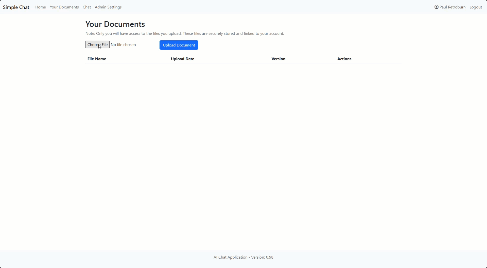

### Classify document and chat with document


## Detailed Workflows

> <a href="#simple-chat" style="text-decoration: none;">Return to top</a>

### Content Safety

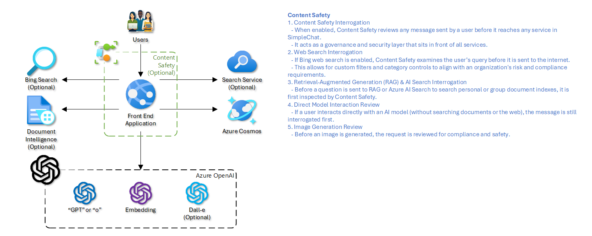 

1.  **User Sends Message**: A user types a message in the chat interface.
2.  **Content Safety Interrogation (If Enabled)**:
    *   Before the message reaches *any* backend service (AI model, Search, Image Gen, etc.), it is sent to the configured **Azure AI Content Safety** endpoint.
    *   Content Safety analyzes the text for harmful content based on configured categories (Hate, Sexual, Violence, Self-Harm) and severity thresholds.
    *   Custom blocklists can also be applied.
3.  **Decision Point**:
    *   **If Safe**: The message proceeds to the intended service (e.g., Web Search, RAG, Direct Model Interaction, Image Generation).
    *   **If Unsafe**: The message is blocked. The user receives a generic notification (or configured message). Details of the violation may be logged (if configured) and potentially viewable by users with the `SafetyAdmin` role.
4.  **Service Interaction (If Safe)**:
    *   **Web Search**: The query is sent to Bing Search (if enabled).
    *   **RAG / AI Search**: The query is used to search Azure AI Search indexes (personal/group).
    *   **Direct Model Interaction**: The message is sent directly to the Azure OpenAI GPT model.
    *   **Image Generation**: The prompt is sent to the Azure OpenAI DALL-E model (if enabled).
    *   *Note:* Responses from these services are typically *not* sent back through Content Safety by default in this flow, though Azure OpenAI itself has built-in content filtering.

### Add your data (RAG Ingestion)

This workflow describes how documents uploaded via "Your Workspace" or "Group Workspaces" are processed for Retrieval-Augmented Generation.

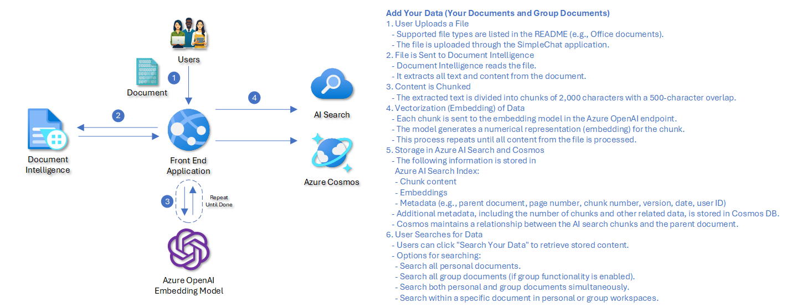 

1.  **User Uploads File(s)**:
    *   User selects one or more supported files via the application UI (e.g., PDF, DOCX, TXT, MP4, MP3).
    *   Files are sent to the backend application running on Azure App Service.
2.  **Initial Processing & Text Extraction**:
    *   The backend determines the file type.
    *   The file is sent to the appropriate service for text extraction:
        *   **Azure AI Document Intelligence**: For PDFs, Office Docs, Images (OCR). Extracts text, layout, tables.
        *   **Azure Video Indexer**: For videos. Extracts audio transcript and frame OCR text (if enabled).
        *   **Azure Speech Service**: For audio files. Extracts audio transcript (if enabled).
        *   **Internal Parsers**: For plain text, HTML, Markdown, JSON, CSV.
3.  **Content Chunking**:
    *   The extracted text content is divided into smaller, manageable chunks based on file type and content structure.
    *   Chunking strategies vary (see [Advanced Chunking Logic](#advanced-chunking-logic) under Latest Features) but aim for semantic coherence and appropriate size (~400-1200 words, depending on type), often with overlap between chunks to preserve context. Timestamps or page numbers are included where applicable.
4.  **Vectorization (Embedding)**:
    *   Each text chunk is sent to the configured **Embedding Model** endpoint in **Azure OpenAI**.
    *   The model generates a high-dimensional **vector embedding** (a numerical representation) for the semantic content of the chunk.
    *   This process repeats for all chunks from the uploaded file(s).
5.  **Storage in Azure AI Search and Cosmos DB**:
    *   For each chunk, the following are stored in the appropriate **Azure AI Search Index** (`simplechat-user-index` or `simplechat-group-index`):
        *   Chunk content (text).
        *   Vector embedding.
        *   Metadata: Parent document ID, user/group ID, filename, chunk sequence number, page number (if applicable), timestamp (if applicable), classification tags (if applicable), extracted keywords/summary (if applicable).
    *   Metadata about the **parent document** (e.g., original filename, total chunks, upload date, user ID, group ID, document version, classification, processing status) is stored in **Azure Cosmos DB**.
    *   Cosmos DB maintains the relationship between the parent document record and its constituent chunks stored in Azure AI Search.
6.  **Ready for Retrieval**:
    *   Once indexed, the document content is available for hybrid search (vector + keyword) when users toggle "Search Your Data" or perform targeted searches within workspaces.

## Prerequisites

> <a href="#simple-chat" style="text-decoration: none;">Return to top</a>

Before you begin the setup, ensure you have the following:

1.  **Azure Subscription**: An active Azure subscription with permissions to create and manage resources (App Service, Azure OpenAI, Cosmos DB, AI Search, etc.). Contributor role at the subscription or resource group level is typically sufficient.
2.  **Azure Active Directory (Entra ID)**: Access to an Azure AD tenant where you can register applications and manage user/group assignments. Permissions to grant admin consent for API permissions might be required.
3.  **Git**: Git installed locally for cloning the repository.
4.  **Development Environment**:
    *   **Visual Studio Code (Recommended)**: With the **Azure Tools Extension Pack** and **Azure App Service extension** installed.
    *   Alternatively, the **Azure CLI** for command-line operations.
5.  **Python**: A local Python environment (3.12 recommended) can be helpful for local testing or dependency management, though deployment primarily relies on the App Service runtime.

## Setup Instructions

> <a href="#simple-chat" style="text-decoration: none;">Return to top</a>

### Provision Azure Resources

Deploy the necessary Azure services. For a quick estimate of monthly costs based on recommended baseline SKUs for a Demo/Proof-of-Concept (POC)/Minimum Viable Product (MVP) solution, refer to the [Azure Pricing Calculator Link](https://azure.com/e/86504dd2857343ae80bda654ae4cc2f4). The services and SKUs below are reflected in that estimate.

> [!IMPORTANT]
> The following recommended SKUs are intended for **Development, Demo, POC, or MVP purposes only**. You **must** scale these services appropriately based on expected user load, data volume, and performance requirements when moving to a Production environment. Factors like concurrent users, document ingestion rate, and query complexity will influence the required tiers and instance counts.

| Service Type                 | Recommended Minimum SKU (for Dev/Demo/POC/MVP)               | Description / Notes                                          |
| :--------------------------- | :----------------------------------------------------------- | :----------------------------------------------------------- |
| **App Service (Frontend)**   | Premium V3 P0v3 (1 Core, 4 GB RAM, 250 GB Storage), Linux    | Hosts the Python Flask web application. Consider scaling up (P1v3+) or out (multiple instances) for production. |
| **Azure OpenAI (GPT)**       | Standard S0, `gpt-4o` deployment                             | Powers core chat functionality and optional Metadata Extraction. Choose model based on cost/performance needs. Pay-as-you-go pricing. |
| **Azure OpenAI (Embedding)** | Standard S0, `text-embedding-3-small` deployment             | Required for RAG (Your Workspace, My Groups). Generates vector embeddings. Pay-as-you-go. |
| **Azure OpenAI (Image Gen)** | Standard S0, `dall-e-3` deployment (Optional)                | Required only if Image Generation feature is enabled. Pay-as-you-go per image. |
| **Azure AI Search**          | Standard S1 (consider S2/S3 for larger scale/HA)             | Stores and indexes document chunks for RAG. Includes Semantic Ranker capacity. Scale units/replicas/partitions for performance/HA. |
| **Content Safety**           | Standard S0 (Optional)                                       | Required only if Content Safety feature is enabled. Pay-as-you-go per 1k text records / 1k images. |
| **Document Intelligence**    | Standard S0                                                  | Used for text/layout extraction from various file types during ingestion. Pay-as-you-go per page processed. |
| **Bing Search**              | Standard S1 (Optional)                                       | Required only if Bing Web Search feature is enabled. Pay-as-you-go per 1k transactions. |
| **Cosmos DB (NoSQL)**        | Autoscale provisioned throughput (Start ~1000 RU/s), Single-Region Write | Stores metadata, conversations, settings. Autoscale helps manage costs, but monitor RU consumption and adjust max RU for production loads. |
| **Video Indexer**            | Standard Tier (Optional)                                     | Required only if Video Extraction feature is enabled. Pay-as-you-go per input content minute (All Insights). |
| **Speech Service**           | Standard S0 (Optional)                                       | Required only if Audio Extraction feature is enabled. Pay-as-you-go per audio hour (Standard fast transcription). |
| **Storage Account**          | General Purpose V2, LRS, Hot Tier (Optional)                 | Required only if Enhanced Citations feature is enabled. Stores processed files. Hierarchical Namespace (ADLS Gen2) recommended. |

> **Note**: Pricing is subject to change and varies significantly based on usage, region, specific configurations (e.g., network security, backup policies), and selected tiers. Always use the official Azure Pricing Calculator and monitor your Azure costs closely.

**Deployment Steps:**

1.  **Create or Select a Resource Group**:
    *   Group all related resources within a single Azure Resource Group (e.g., `rg-simple-chat-prod`, `rg-simple-chat-dev`).
    *   Deploy resources in the same Azure region where possible to minimize latency, unless specific service availability or compliance dictates otherwise (e.g., Azure OpenAI model availability).
2.  **Deploy App Service**:
    *   Create an Azure App Service instance.
    *   **Publish**: Code
    *   **Runtime stack**: Python 3.12
    *   **Operating System**: Linux
    *   **Region**: Choose your desired region.
    *   **App Service Plan**: Create a new Linux plan using the **Premium V3 (P0v3)** tier (or higher for production). Zone redundancy typically **Disabled** for baseline, enable for HA if needed.
    *   Review Networking (Public access defaults), Deployment, Monitoring settings. Modify based on organizational security/operational requirements.
    *   Note the default **App Name** and **URL** (e.g., `https://my-simplechat-app.azurewebsites.net`). This URL will be needed for AAD App Registration redirects.
3.  **Deploy Azure OpenAI Service(s)**:
    *   You can deploy a single Azure OpenAI resource hosting all models or separate resources (e.g., one for GPT, one for Embeddings) based on regional availability or management preference.
    *   Create an **Azure OpenAI** resource. Select **Standard S0** pricing tier.
    *   **Deploy Models**: Within the Azure OpenAI Studio for your resource(s), deploy the required models with custom deployment names:
        *   **GPT Model**: e.g., `gpt-4o` (Required for chat, optional for metadata). Note the **Deployment Name**.
        *   **Embedding Model**: e.g., `text-embedding-3-small` (Required for Workspaces/RAG). Note the **Deployment Name**.
        *   **Image Generation Model**: e.g., `dall-e-3` (Required for optional Image Generation). Note the **Deployment Name**.
    *   Review Networking settings (default public access, modify as needed).
    *   If using **Managed Identity** authentication later, you will need to grant the App Service's Managed Identity the `Cognitive Services OpenAI User` role on this resource(s).
4.  **Deploy Azure AI Search**:
    *   Create an **Azure AI Search** service.
    *   Select the **Standard S1** tier (or higher based on scale/HA needs). Consider replicas/partitions for production.
    *   Review Networking settings.
    *   You will initialize indexes later ([Initializing Indexes](#initializing-indexes-in-azure-ai-search)).
    *   If using **Managed Identity**, grant the App Service's Managed Identity the `Search Index Data Contributor` role on this resource.
5.  **Deploy Azure Cosmos DB**:
    *   Create an **Azure Cosmos DB** account.
    *   Select the **Azure Cosmos DB for NoSQL** API.
    *   **Capacity mode**: Provisioned throughput. Choose **Autoscale**.
    *   Set **Max throughput** at the database level initially (e.g., start with 1000 RU/s, monitor and adjust).
        - Note: Autoscale automatically adjusts the provisioned Request Units (RU/s) between 10% and 100% of this maximum value based on usage (e.g., 1000 max RU/s scales between 100 - 1000 RU/s).
        - **Container-Level Scaling (Recommended Post-Setup)**: While you set an initial database-level throughput, it's highly recommended to configure Autoscale throughput **per container** after the application creates them (or manually create them with these settings). For optimal performance and cost-efficiency, consider setting the *maximum* Autoscale throughput for key containers as follows:
          - messages container: **4000 RU/s** (will scale between 400 - 4000 RU/s)
          - documents container: **4000 RU/s** (will scale between 400 - 4000 RU/s)
          - group_documents container: **4000 RU/s** (will scale between 400 - 4000 RU/s)
          - Other containers (like settings, feedback, archived_conversations) often have lower usage and can typically start with a lower maximum (e.g., 1000 RU/s, scaling 100-1000 RU/s), but monitor their consumption.
    *   **Apply Free Tier Discount**: **DO NOT APPLY** (Free tier throughput is insufficient).
    *   **Limit total account throughput**: **Uncheck** (DISABLE).
    *   Review Networking, Backup Policy, Encryption settings.
    *   If using **Managed Identity**, grant the App Service's Managed Identity the `Cosmos DB Built-in Data Contributor` role (or create custom roles for least privilege). *Note: Managed Identity support for Cosmos DB data plane might require specific configurations.* Key-based auth is simpler initially.
6.  **Deploy Azure AI Document Intelligence**:
    *   Create an **Azure AI Document Intelligence** (formerly Form Recognizer) resource.
    *   Select the **Standard S0** pricing tier.
    *   Review Networking settings.
    *   If using **Managed Identity**, grant the App Service's Managed Identity the `Cognitive Services User` role on this resource.
7.  **Deploy Azure AI Content Safety (Optional)**:
    *   If using the Content Safety feature, create an **Azure AI Content Safety** resource.
    *   Select the **Standard S0** pricing tier.
    *   Review Networking settings.
    *   If using **Managed Identity**, grant the App Service's Managed Identity the `Cognitive Services Contributor` role on this resource.
8.  **Deploy Bing Search Service (Optional)**:
    *   If using the Bing Web Search feature, create a **Bing Search v7** resource.
    *   Select the **S1** tier (or adjust based on expected query volume).
    *   Note the **Endpoint** and one of the **Keys**. These will be configured in the application's Admin Settings later.
9.  **Deploy Azure Video Indexer (Optional)**:
    *   If using the Video Extraction feature, create an **Azure Video Indexer** resource.
    *   You'll need to associate it with an Azure Media Services account (can be created during VI setup) and a Storage Account (used for temporary processing, can be new or existing).
    *   Managed Identity (System-assigned) is typically enabled by default.
    *   Note the **Account ID**, **Location**, and an **API Key** (Subscription level or Account level). These will be configured in Admin Settings.
10. **Deploy Azure Speech Service (Optional)**:
    *   If using the Audio Extraction feature, create an **Azure AI Speech** resource.
    *   Select the **Standard S0** pricing tier.
    *   Review Networking and Identity settings.
    *   Note the **Endpoint**, **Region/Location**, and one of the **Keys**. These will be configured in Admin Settings.
11. **Deploy Storage Account (Optional)**:
    *   If using the Enhanced Citations feature, create an **Azure Storage Account**.
    *   **Performance**: Standard.
    *   **Redundancy**: LRS (or higher based on requirements).
    *   **Account Kind**: StorageV2 (general purpose v2).
    *   **Enable hierarchical namespace** (Azure Data Lake Storage Gen2) is recommended for better organization if storing large volumes.
    *   Review Networking, Data protection, Encryption settings.
    *   Note the **Connection String** (under Access Keys or SAS token). This will be configured in Admin Settings. If using Managed Identity, grant the App Service's Managed Identity the `Storage Blob Data Contributor` role.

### Application-Specific Configuration Steps

> <a href="#simple-chat" style="text-decoration: none;">Return to top</a>

With the Azure resources provisioned, proceed with configuring the application itself. Perform these steps in order.

#### Setting Up Authentication (Azure AD / Entra ID)

The application uses Azure Active Directory (Entra ID) for user authentication and role management.

1.  **Register an Application in Azure AD**:
    *   Navigate to **Azure Active Directory** > **App registrations** > **+ New registration**.
    *   Give it a name (e.g., `SimpleChatApp-Prod`).
    *   Select **Accounts in this organizational directory only** (or adjust if multi-tenant access is needed).
    *   Set the **Redirect URI**:
        *   Select **Web** platform.
        *   Enter the URI: `https://<your-app-service-name>.azurewebsites.net/.auth/login/aad/callback` (Replace `<your-app-service-name>` with your actual App Service name).
    *   Click **Register**.
    *   Note the **Application (client) ID** and **Directory (tenant) ID**. These are needed for the `.env` file (`CLIENT_ID`, `TENANT_ID`).

2.  **Configure App Service Authentication**:
    *   Go to your **App Service** in the Azure portal.
    *   Navigate to **Settings** > **Authentication**.
    *   Click **Add identity provider**.
    *   **Identity provider**: Microsoft
    *   **App registration type**: Pick an existing app registration in this directory.
    *   Select the **App registration** you just created.
    *   **Restrict access**: Require authentication.
    *   **Unauthenticated requests**: HTTP 302 Found redirect: recommended for web apps.
    *   Click **Add**. This configures the built-in App Service Authentication (Easy Auth).
    *   **Important**: After adding the provider, go back into the **Authentication** settings for the App Service, click **Edit** on the Microsoft provider. Ensure the **Issuer URL** is correct (usually `https://login.microsoftonline.com/<your-tenant-id>/v2.0`). Note the **Client Secret** value shown here (or create a new one under the App Registration -> Certificates & secrets). This secret (`MICROSOFT_PROVIDER_AUTHENTICATION_SECRET`) is often automatically added to App Service Application Settings, but verify it's present.

    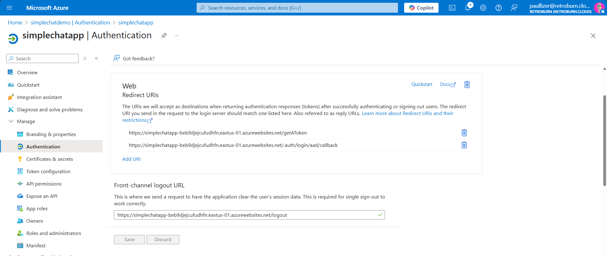  *(Note: Image shows general area, details might differ slightly)*

3.  **Configure API Permissions**:
    *   Go back to your **App Registration** in Azure AD.
    *   Navigate to **API permissions**.
    *   Click **+ Add a permission**.
    *   Select **Microsoft Graph**.
    *   Select **Delegated permissions**.
    *   Add the following permissions:
        *   `email`
        *   `offline_access`
        *   `openid`
        *   `profile`
        *   `User.Read` (Allows sign-in and reading the user's profile)
        *   `User.ReadBasic.All` (Allows reading basic profiles of all users - often needed for people pickers if not using `People.Read.All`)
        *   **(Conditional)** `People.Read.All`: **Required if** you enable the **My Groups** feature, as it's used to search for users within your tenant to add to groups. Add this permission if needed.
    *   After adding permissions, click **Grant admin consent for [Your Tenant Name]**. This is crucial, especially for `*.All` permissions.

    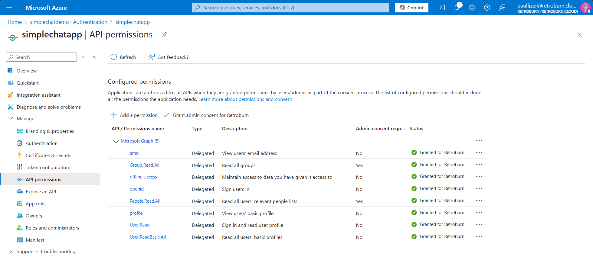 

4.  **Configure App Roles**:
    *   In your **App Registration**, navigate to **App roles**.
    *   Click **+ Create app role**.
    *   Create roles based on the following table. Repeat for each role:

    | Display Name               | Allowed member types | Value                  | Description                                      | Do you want to enable this app role? |
    | :------------------------- | :------------------- | :--------------------- | :----------------------------------------------- | :----------------------------------- |
    | **Admins**                 | Users/Groups         | `Admin`                | Allows access to Admin Settings page.            | Yes                                  |
    | **Users**                  | Users/Groups         | `User`                 | Standard user access to chat features.           | Yes                                  |
    | **Create Group**           | Users/Groups         | `CreateGroups`         | Allows user to create new groups (if enabled).   | Yes                                  |
    | **Safety Violation Admin** | Users/Groups         | `SafetyViolationAdmin` | Allows access to view content safety violations. | Yes                                  |
    | **Feedback Admin**         | Users/Groups         | `FeedbackAdmin`        | Allows access to view user feedback admin page.  | Yes                                  |

    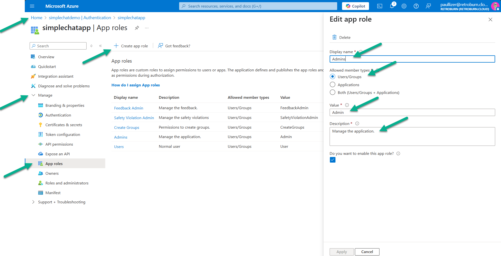 

5.  **Assign Users/Groups to Roles via Enterprise Application**:
    *   App Roles are *assigned* through the **Enterprise Application** associated with your App Registration.
    *   Navigate to **Azure Active Directory** > **Enterprise applications**.
    *   Find the application with the same name as your App Registration (or search by Application ID).
    *   Select your Enterprise Application.
    *   Go to **Users and groups**.
    *   Click **+ Add user/group**.
    *   Select the users or security groups you want to grant access.
    *   Under **Select a role**, choose the appropriate App Role (`Admins`, `Users`, etc.) you defined.
    *   Click **Assign**. Only assigned users/groups will be able to log in (if "Assignment required?" is enabled on the Enterprise App, which is recommended).

#### Grant App Registration Access to Azure OpenAI (for Model Fetching)

The application needs permission to list the available models deployed in your Azure OpenAI resource(s). This uses the *App Registration's Service Principal*.

1.  Go to each **Azure OpenAI** service resource in the Azure portal.
2.  Select **Access control (IAM)**.
3.  Click **+ Add** > **Add role assignment**.
4.  Search for and select the role **Cognitive Services OpenAI User**. Click Next.
5.  **Assign access to**: Select **User, group, or service principal**.
6.  **Members**: Click **+ Select members**.
7.  Search for the **name of your App Registration** (e.g., `SimpleChatApp-Prod`). Select it.
8.  Click **Select**, then **Next**.
9.  Click **Review + assign**.
10. Repeat for *all* Azure OpenAI resources used by the application (GPT, Embedding, Image Gen if separate).

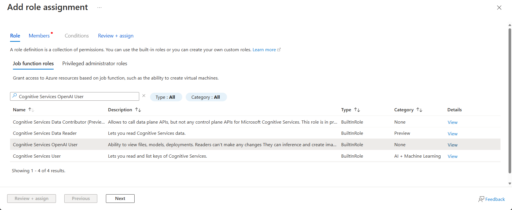 
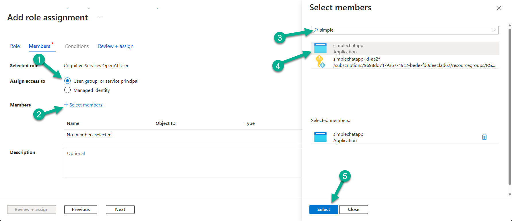

#### Clone the Repository

Get the application code onto your local machine.

1.  Open a terminal or command prompt.
2.  Use Git to clone the repository:
    ```bash
    git clone <repository-url>
    cd <repository-folder>
    ```
    (Replace `<repository-url>` and `<repository-folder>` accordingly).
    *Alternatively*, use GitHub Desktop or download the ZIP and extract it.

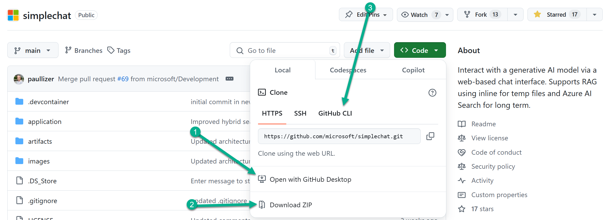 

#### Configure Environment Variables (`.env` File)

Core configuration values are managed via environment variables, typically set in the Azure App Service Application Settings. A `.env` file is used locally and can be uploaded to populate these settings.

1.  **Create `.env` from Example**:
    *   Find the `example.env` file in the cloned repository.
    *   Rename or copy it to `.env`.
2.  **Edit `.env`**:
    *   Open the `.env` file in a text editor (like VS Code).
    *   Fill in the placeholder values with your actual service details:

    ```dotenv
    # Azure Cosmos DB
    # Use connection string OR endpoint/key OR managed identity
    AZURE_COSMOS_ENDPOINT="<your-cosmosdb-account-uri>" # e.g., https://mycosmosdb.documents.azure.com:443/
    AZURE_COSMOS_KEY="<your-cosmosdb-primary-key>"
    AZURE_COSMOS_AUTHENTICATION_TYPE="key" # Options: "key", "connection_string", "managed_identity"
    
    # Azure Bing Search (Only needed if Bing Search feature is enabled in Admin Settings)
    # Endpoint is usually standard, Key obtained from Bing Search resource.
    BING_SEARCH_ENDPOINT="https://api.bing.microsoft.com/"
    
    # Azure AD Authentication (Required)
    CLIENT_ID="<your-app-registration-client-id>"
    TENANT_ID="<your-azure-ad-tenant-id>"
    # SECRET_KEY should be a long, random, secret string (e.g., 32+ chars) used for Flask session signing. Generate one securely.
    SECRET_KEY="Generate-A-Strong-Random-Secret-Key-Here!"
    # AZURE_ENVIRONMENT: Set based on your cloud environment
    AZURE_ENVIRONMENT="public" # Options: "public", "usgovernment"
    ```
    
3.  **Upload Settings to Azure App Service (Recommended using VS Code)**:
    
    *   Ensure the `.env` file is saved and **closed**.
    *   In VS Code, with the Azure App Service extension installed and signed in:
        *   **Option 1 (Command Palette)**: Press `Ctrl+Shift+P` (or `Cmd+Shift+P`), type `Azure App Service: Upload Local Settings`, select your subscription and App Service instance, then choose the `.env` file.
        *   **Option 2 (File Explorer)**: Right-click the `.env` file in the VS Code explorer, select `Azure App Service: Upload Local Settings`, and follow the prompts.
    *   This action reads your `.env` file and sets the corresponding **Application Settings** in the Azure App Service configuration blade.
    
    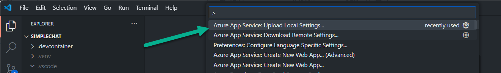 
    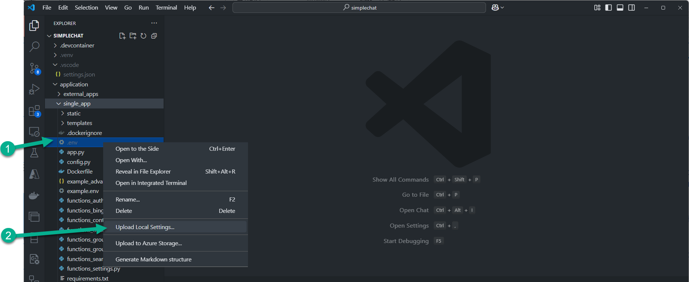
    
4.  **(Optional) Download Settings from Azure App Service**:
    *   To verify or synchronize settings from Azure back to a local `.env` file:
    *   Press `Ctrl+Shift+P`, type `Azure App Service: Download Remote Settings`, select your App Service, and choose where to save the file (e.g., overwrite your local `.env`). This is useful to capture settings automatically added by Azure (like `APPLICATIONINSIGHTS_CONNECTION_STRING` or `WEBSITE_AUTH_AAD_ALLOWED_TENANTS`).

    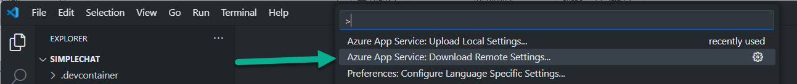 

#### Alternate Method: Update App Settings via JSON (Advanced)

You can directly edit Application Settings in the Azure portal using the "Advanced edit" feature, pasting a JSON array. This is useful for bulk updates but requires care not to overwrite essential settings added by Azure.

1.  Navigate to your **App Service** > **Settings** > **Configuration** > **Application settings**.
2.  **Backup Existing Values**: Before pasting, **copy** the current values for critical settings like `MICROSOFT_PROVIDER_AUTHENTICATION_SECRET`, `APPLICATIONINSIGHTS_CONNECTION_STRING`, and `WEBSITE_AUTH_AAD_ALLOWED_TENANTS`.
3.  **Prepare JSON**: Create a JSON array similar to the example below, inserting your specific values and the backed-up Azure-managed values.
4.  Click **Advanced edit**.
5.  **Carefully replace** the existing JSON content with your prepared JSON.
6.  Click **OK**, then **Save**.

**Example JSON Structure:**

```json
[
    // --- Azure Managed / Essential Settings ---
    { "name": "APPLICATIONINSIGHTS_CONNECTION_STRING", "value": "<your-appinsights-connection-string>", "slotSetting": false },
    { "name": "APPINSIGHTS_INSTRUMENTATIONKEY", "value": "<your-appinsights-instrumentation-key>", "slotSetting": false }, // Often same key as connection string contains
    { "name": "MICROSOFT_PROVIDER_AUTHENTICATION_SECRET", "value": "<app-service-auth-secret>", "slotSetting": true }, // CRITICAL - Get from portal if unsure
    { "name": "WEBSITE_AUTH_AAD_ALLOWED_TENANTS", "value": "<your-tenant-id>", "slotSetting": false }, // Usually set by Auth config
    { "name": "WEBSITE_AUTH_ENABLED", "value": "True", "slotSetting": true }, // Should be set by Auth config
    { "name": "WEBSITE_AUTH_DEFAULT_PROVIDER", "value": "AzureActiveDirectory", "slotSetting": true }, // Should be set by Auth config

    // --- Your Application Settings (from .env) ---
    { "name": "AZURE_COSMOS_ENDPOINT", "value": "<your-cosmosdb-endpoint>", "slotSetting": false },
    { "name": "AZURE_COSMOS_KEY", "value": "<your-cosmosdb-key>", "slotSetting": false },
    { "name": "AZURE_COSMOS_DATABASE", "value": "SimpleChat", "slotSetting": false },
    { "name": "AZURE_COSMOS_AUTHENTICATION_TYPE", "value": "key", "slotSetting": false }, // or "managed_identity"
    { "name": "CLIENT_ID", "value": "<your-app-registration-client-id>", "slotSetting": false },
    { "name": "TENANT_ID", "value": "<your-azure-ad-tenant-id>", "slotSetting": false },
    { "name": "SECRET_KEY", "value": "<your-flask-secret-key>", "slotSetting": false },
    { "name": "AZURE_ENVIRONMENT", "value": "public", "slotSetting": false }, // or "usgovernment"
    { "name": "BING_SEARCH_ENDPOINT", "value": "https://api.bing.microsoft.com/", "slotSetting": false },

    // --- Build & Runtime Settings ---
    { "name": "SCM_DO_BUILD_DURING_DEPLOYMENT", "value": "true", "slotSetting": false }, // Ensures requirements.txt is processed
    { "name": "WEBSITE_HTTPLOGGING_RETENTION_DAYS", "value": "7", "slotSetting": false },

    // --- Optional App Insights Advanced Settings (Defaults usually fine) ---
    { "name": "ApplicationInsightsAgent_EXTENSION_VERSION", "value": "~3", "slotSetting": false },
    { "name": "APPLICATIONINSIGHTSAGENT_EXTENSION_ENABLED", "value": "true", "slotSetting": false },
    { "name": "XDT_MicrosoftApplicationInsights_Mode", "value": "default", "slotSetting": false },
    { "name": "APPINSIGHTS_PROFILERFEATURE_VERSION", "value": "1.0.0", "slotSetting": false },
    { "name": "APPINSIGHTS_SNAPSHOTFEATURE_VERSION", "value": "1.0.0", "slotSetting": false },
    { "name": "SnapshotDebugger_EXTENSION_VERSION", "value": "disabled", "slotSetting": false },
    { "name": "InstrumentationEngine_EXTENSION_VERSION", "value": "disabled", "slotSetting": false },
    { "name": "XDT_MicrosoftApplicationInsights_BaseExtensions", "value": "disabled", "slotSetting": false },
    { "name": "XDT_MicrosoftApplicationInsights_PreemptSdk", "value": "disabled", "slotSetting": false }
]
```

> [!WARNING]
>
> Editing Application Settings via JSON is powerful but risky. Incorrectly modifying or omitting settings managed by Azure (especially Authentication or App Insights integration) can break functionality. Proceed with caution and always back up existing values. Using the .env upload method is generally safer.

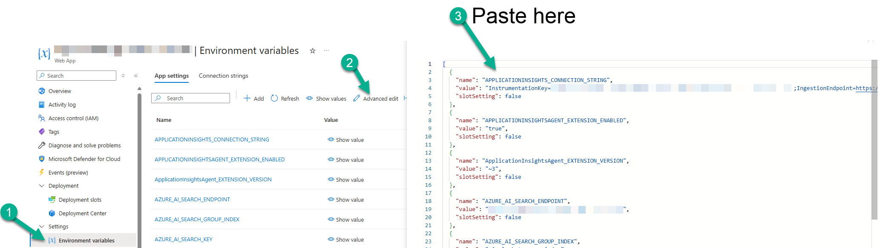

#### Initializing Indexes in Azure AI Search

The application requires two Azure AI Search indexes: one for personal user documents and one for shared group documents. The schemas are defined in JSON files within the repository.

1. **Locate Index Schema Files**:

   - In your cloned repository, find the artifacts/ai_search_index/ directory.
   - It contains ai_search-index-user.json and ai_search-index-group.json.

   ```
   📁 SimpleChat
        └── 📁 artifacts
            └── 📁 ai_search_index
                ├── ai_search-index-group.json
                └── ai_search-index-user.json
   ```

2. **Access Azure AI Search in Azure Portal**:

   - Navigate to your **Azure AI Search** service resource.
   - Under **Search management**, select **Indexes**.

3. **Create Indexes from JSON**:

   - Click **+ Add index**.
   - Change the creation method from Enter index name to **Import from JSON**.
   - **User Index**:
     - Open ai_search-index-user.json locally, copy its entire content.
     - Paste the JSON into the **Index definition (JSON)** editor in the portal.
     - The Index Name should automatically populate as simplechat-user-index.
     - Click **Save**.
   - **Group Index**:
     - Click **+ Add index** again and choose **Import from JSON**.
     - Open ai_search-index-group.json locally, copy its content.
     - Paste the JSON into the editor.
     - The Index Name should populate as simplechat-group-index.
     - Click **Save**.

4. **Verify Indexes**:

   - You should now see simplechat-user-index and simplechat-group-index listed under **Indexes**.

> [!NOTE]
>
> **Automatic Schema Update Feature**: If you happen to miss this step or deploy an updated version of the application with new required index fields, the application includes a mechanism to help. When an Admin user navigates to the **Admin > App Settings** page, the application backend checks the schemas of the existing simplechat-user-index and simplechat-group-index against the expected schema. If missing fields are detected, notification buttons will appear at the top of the Admin Settings page: "**Add missing user fields**" and "**Add missing group fields**". Clicking these buttons will automatically add the missing fields to your Azure AI Search indexes without data loss. While this feature provides resilience, it's still recommended to create the indexes correctly using the JSON definitions initially.

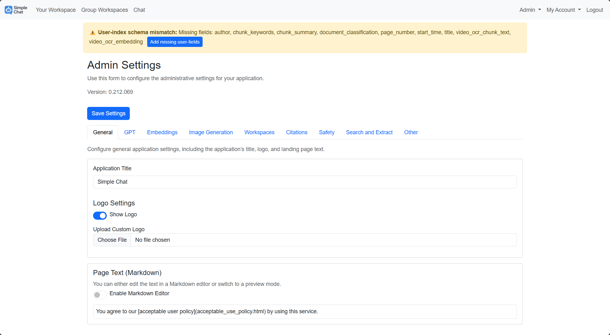

### Installing and Deploying the Application Code

Deploy the application code from your local repository to the Azure App Service.

#### Deploying via VS Code (Recommended for Simplicity)

1. **Ensure Azure Extensions are Installed**: You need the **Azure Tools Extension Pack** and the **Azure App Service** extension in VS Code.
2. **Sign In to Azure**: Use the Azure extension to sign in to your Azure account.
3. **Deploy**:
   - In the VS Code Activity Bar, click the Azure icon.
   - Expand **App Service**, find your subscription and the App Service instance you created.
   - **Right-click** on the App Service name.
   - Select **Deploy to Web App...**.
   - Browse and select the folder containing the application code (the root folder you cloned, e.g., SimpleChat).
   - VS Code will prompt to confirm the deployment, potentially warning about overwriting existing content. Click **Deploy**.
   - Make sure your requirements.txt file is up-to-date before deploying. The deployment process (SCM_DO_BUILD_DURING_DEPLOYMENT=true) will use this file to install dependencies on the App Service.
   - Monitor the deployment progress in the VS Code Output window.

#### Deploying via Azure CLI (Zip Deploy)

This method involves creating a zip file of the application code and uploading it using the Azure CLI. Refer to the official documentation for detailed steps: [Quickstart: Deploy a Python web app to Azure App Service](https://www.google.com/url?sa=E&q=https://learn.microsoft.com/en-us/azure/app-service/quickstart-python?tabs=flask%2Cwindows%2Cazure-cli%2Czip-deploy%2Cdeploy-instructions-azportal%2Cterminal-bash%2Cdeploy-instructions-zip-azcli).

**Key Steps:**

1. **Create the ZIP file**:

   - Navigate into the application's root directory (e.g., SimpleChat) in your terminal.
   - Create a zip file containing **only** the necessary application files and folders. **Crucially, zip the contents, not the parent folder itself.**
   - **Include**:
     - static/ folder
     - templates/ folder
     - requirements.txt file
     - All Python files (*.py) at the root level (e.g., app.py, utils.py, etc.).
     - Any other necessary support files or directories at the root level.
   - **Exclude**:
     - .git/ folder and .gitignore
     - .vscode/ folder
     - __pycache__/ directories
     - .env, example.env (environment variables are set in App Settings)
     - .deployment, Dockerfile, .dockerignore (unless specifically using Docker deployment)
     - README.md, LICENSE, .DS_Store, etc.
     - Any local virtual environment folders (e.g., .venv, env).

   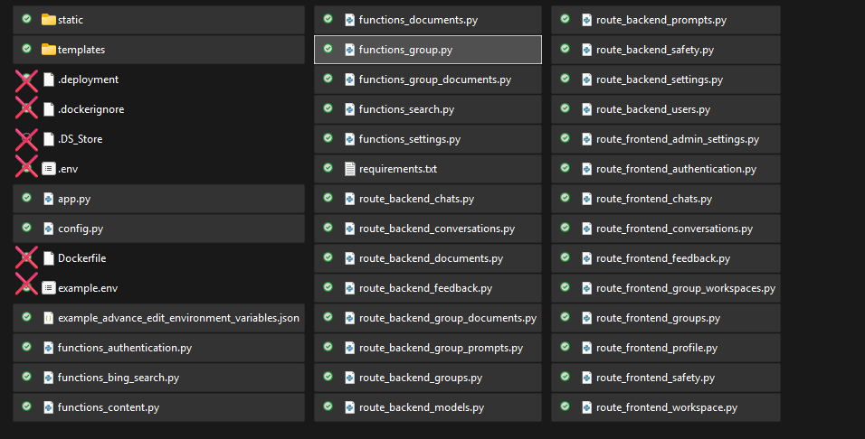

   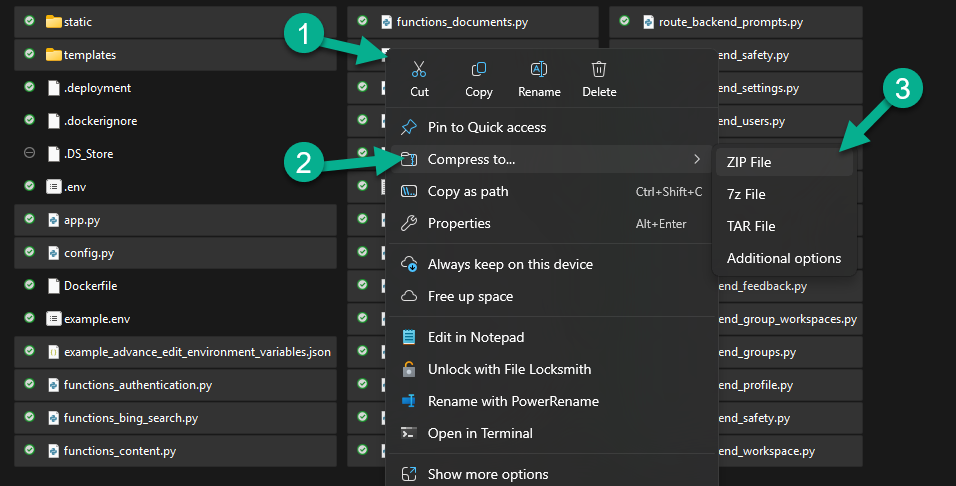

   **Ensure SCM_DO_BUILD_DURING_DEPLOYMENT is Set**: Verify this application setting is true in your App Service configuration to ensure dependencies are installed from requirements.txt during deployment.

2. **Deploy using Azure CLI**:

   ```
   az login # Sign in if you haven't already
   az account set --subscription "<Your-Subscription-ID>"
   
   az webapp deploy --resource-group <Your-Resource-Group-Name> --name <Your-App-Service-Name> --src-path ../deployment.zip --type zip
   ```

### Running the Application

1. Navigate to your **App Service** in the Azure Portal.
2. On the **Overview** blade, find the **Default domain** URL (e.g., https://my-simplechat-app.azurewebsites.net).
3. Click the URL to open the application in your browser.
4. You should be redirected to the Microsoft login page to authenticate via Azure AD. Log in with a user account that has been assigned a role in the Enterprise Application.

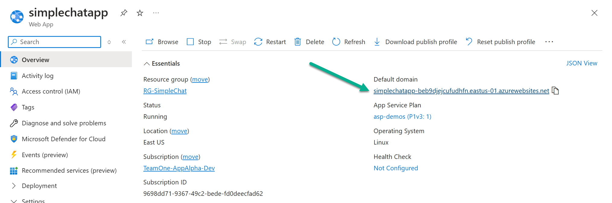

### Upgrading the Application

> <a href="#simple-chat" style="text-decoration: none;">Return to top</a>

Keeping your Simple Chat application up-to-date involves deploying the newer version of the code. Using **Deployment Slots** is the recommended approach for production environments to ensure zero downtime and provide easy rollback capabilities.

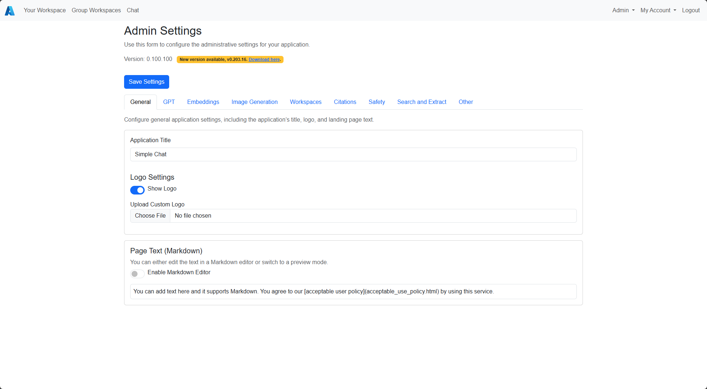

#### Using Deployment Slots (Recommended for Production/Staging)

1. **Create a Deployment Slot**:

   - In your App Service, go to **Deployment** > **Deployment slots**.
   - Click **+ Add Slot**. Give it a name (e.g., staging).
   - Choose to **clone settings** from the production slot initially.
   - This creates a fully functional, independent instance of your app connected to the same App Service Plan.

2. **Deploy New Version to Staging Slot**:

   - Deploy the updated application code (using VS Code deployment or az webapp deploy) specifically targeting the **staging slot**.

   - **VS Code**: When deploying, VS Code will prompt you to select the target slot (production or staging). Choose staging.

   - **Azure CLI**: Add the --slot staging parameter to your az webapp deploy command:

     ```
     az webapp deploy --resource-group <RG_Name> --name <App_Name> --src-path <Zip_Path> --type zip --slot staging
     ```

3. **Test the Staging Slot**:

   - The staging slot has its own unique URL (e.g., https://my-simplechat-app-staging.azurewebsites.net). Access this URL directly.
   - Thoroughly test all application functionality, including new features and critical paths, in the staging environment. This slot typically uses the same backend resources (Cosmos DB, AI Search, etc.) as production unless configured otherwise (e.g., using slot-specific Application Settings).

4. **Swap Staging to Production**:

   - Once confident the new version in staging is stable, go back to **Deployment slots** in the Azure portal.

   - Click the **Swap** button.

   - Configure the swap:

     - **Source**: staging
     - **Target**: production

   - Azure performs a "warm-up" of the staging slot instance before redirecting production traffic to it. The previous production code is simultaneously moved to the staging slot. This swap happens near-instantly from a user perspective.

   - **Azure CLI Swap Command**:

     ```
     az webapp deployment slot swap --resource-group <RG_Name> --name <App_Name> --slot staging --target-slot production
     ```

5. **Monitor and Rollback (If Necessary)**:

   - Monitor the application closely after the swap using Application Insights and user feedback.
   - If critical issues arise, you can perform another **Swap** operation, this time swapping production (which now contains the problematic code) back with staging (which now contains the previous stable code). This provides an immediate rollback.

#### Using Direct Deployment to Production (Simpler, for Dev/Test or Low Impact Changes)

You can deploy directly to the production slot using the same VS Code or Azure CLI methods described in the initial deployment section, simply omitting the --slot parameter or choosing the production slot in VS Code.

> [!WARNING]
>
> Deploying directly to production overwrites the live code. This will cause a brief application restart and offers no immediate rollback capability (you would need to redeploy the previous version). This method is generally **not recommended** for production environments or significant updates due to the downtime and risk involved.

#### Automate via CI/CD

For mature development practices, set up a Continuous Integration/Continuous Deployment (CI/CD) pipeline using tools like GitHub Actions or Azure DevOps Pipelines. A typical pipeline would:

1. Trigger on code commits/merges to specific branches (e.g., main, release/*).
2. Build the application artifact (e.g., create the zip file).
3. Deploy the artifact to the staging slot.
4. (Optional) Run automated tests against the staging slot.
5. Require manual approval (or automatically trigger based on test results) to perform the swap operation to production.

### Admin Settings Configuration

> <a href="#simple-chat" style="text-decoration: none;">Return to top</a>

Once the application is running and you log in as a user assigned the Admin role, you can access the **Admin Settings** page. This UI provides a centralized location to configure most application features and service connections.

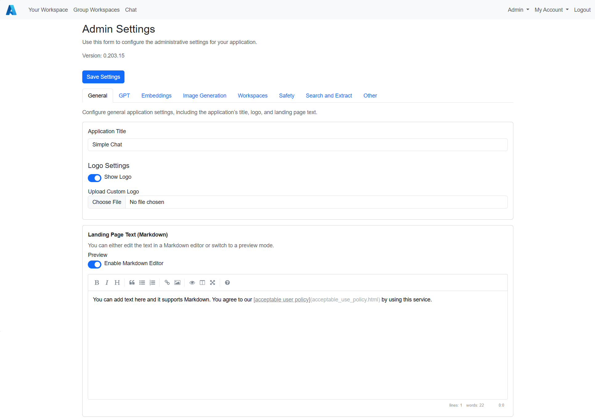

Key configuration sections include:

1. **General**: Application title, custom logo upload, landing page markdown text.
2. **GPT**: Configure Azure OpenAI endpoint(s) for chat models. Supports Direct endpoint or APIM. Allows Key or Managed Identity authentication. Test connection button. Select active deployment(s).
   1. Setting up Multi-model selection for users
3. **Embeddings**: Configure Azure OpenAI endpoint(s) for embedding models. Supports Direct/APIM, Key/Managed Identity. Test connection. Select active deployment.
4. **Image Generation** *(Optional)*: Enable/disable feature. Configure Azure OpenAI DALL-E endpoint. Supports Direct/APIM, Key/Managed Identity. Test connection. Select active deployment.
5. **Workspaces**:
   - Enable/disable **Your Workspace** (personal docs).
   - Enable/disable **My Groups** (group docs). Option to enforce `CreateGroups` RBAC role for creating new groups.
   - Enable/disable **Multimedia Support** (Video/Audio uploads). Configure **Video Indexer** (Account ID, Location, Key, API Endpoint, Timeout) and **Speech Service** (Endpoint, Region, Key).
   - Enable/disable **Metadata Extraction**. Select the GPT model used for extraction.
   - Enable/disable **Document Classification**. Define classification labels and colors.
6. **Citations**:
   - Standard Citations (basic text references) are always on.
   - Enable/disable **Enhanced Citations**. Configure **Azure Storage Account Connection String** (or indicate Managed Identity use if applicable).
7. **Safety**:
   - Enable/disable **Content Safety**. Configure endpoint (Direct/APIM), Key/Managed Identity. Test connection.
   - Enable/disable **User Feedback**.
   - Configure **Admin Access RBAC**: Option to require `SafetyViolationAdmin` or `FeedbackAdmin` roles for respective admin views.
   - Enable/disable **Conversation Archiving**.
8. **Search & Extract**:
   - Enable/disable **Bing Web Search**. Configure **Bing Search API Key**. Test connection.
   - Configure **Azure AI Search** connection (Endpoint, Key/Managed Identity). Test connection. (Primarily for testing, main indexing uses backend logic).
   - Configure **Document Intelligence** connection (Endpoint, Key/Managed Identity). Test connection.
9. **Other**:
   - Set **Maximum File Size** for uploads (in MB).
   - Set **Conversation History Limit** (max number of past conversations displayed).
   - Define the **Default System Prompt** used for the AI model.
   - Enable/disable **File Processing Logs** (verbose logging for ingestion pipelines).

### Azure Government Configuration

> <a href="#simple-chat" style="text-decoration: none;">Return to top</a>

To run the application in Azure Government cloud:

1. **Deploy Resources**: Provision all necessary Azure resources (App Service, OpenAI, Cosmos DB, etc.) within your Azure Government subscription and appropriate Gov regions.

2. **Update Environment Variable**:

   - In the App Service **Application settings** (or your .env file before uploading), set the AZURE_ENVIRONMENT variable:

     ```
     AZURE_ENVIRONMENT="usgovernment"
     ```

   - This ensures the application uses the correct Azure Government endpoints for authentication (MSAL) and potentially for fetching management plane details when using Managed Identity with direct endpoints.

3. **Endpoint URLs**: Ensure all endpoint URLs configured (in App Settings or via the Admin UI) point to the correct .usgovernment.azure.com (or specific service) domains. Azure OpenAI endpoints in Gov are different from Commercial.

4. **App Registration**: Ensure the App Registration is done within your Azure Government Azure AD tenant. The Redirect URI for the App Service will use the .azurewebsites.us domain.

### How to use Managed Identity

> <a href="#simple-chat" style="text-decoration: none;">Return to top</a>

Using Managed Identity allows the App Service to authenticate to other Azure resources securely without needing to store secrets (like API keys or connection strings) in Application Settings.

> [!TIP]
>
> **Recap: Managed Identity vs. App Registration**
>
> - **App Service Managed Identity (System-Assigned or User-Assigned)**: An identity automatically managed by Azure, tied to the App Service instance itself. Used for Azure resource-to-resource authentication (e.g., App Service accessing Cosmos DB data plane). **It cannot be used for user login.**
> - **App Registration (Service Principal)**: An identity created manually in Azure AD representing your application. Used for user authentication flows (via App Service Authentication integration) and potentially for application permissions to APIs like Microsoft Graph. It can *also* be used for resource-to-resource authentication (using client secrets/certificates), but Managed Identity is often preferred for Azure resources.
> - **Enterprise Application**: An instance of an App Registration within your tenant, used to manage user assignments, roles, and SSO configuration.

**Steps to Enable Managed Identity Authentication for Supported Services:**

1. **Enable Managed Identity on App Service**:

   - Go to your **App Service** in the Azure Portal.
   - Navigate to **Settings** > **Identity**.
   - Under the **System assigned** tab, switch **Status** to **On**.
   - Click **Save**. Azure creates an identity for your App Service in Azure AD. Note the **Object (principal) ID**.

   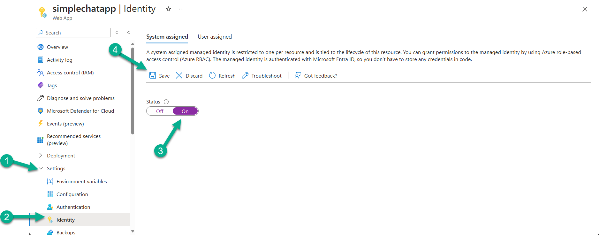

2. **Assign Roles to the Managed Identity**:

   - For each Azure service you want the App Service to access using its Managed Identity, you must grant that identity the appropriate role on the target service.
   - Go to the target Azure resource (e.g., Azure OpenAI, Cosmos DB, AI Search, Storage Account, Document Intelligence, Content Safety).
   - Navigate to **Access control (IAM)**.
   - Click **+ Add** > **Add role assignment**.
   - Select the appropriate role from the table below.
   - **Assign access to**: Select **Managed identity**.
   - **Members**: Click **+ Select members**.
   - Choose the **Subscription**, select **App Service** for the Managed identity type, and then find and select the **name of your App Service instance**. Click **Select**.
   - Click **Review + assign**.

   

   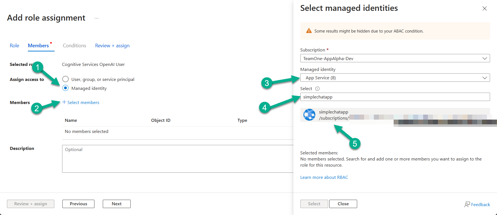

   **Required Roles for Managed Identity Access:**

   | Target Service        | Required Role                       | Notes                                                        |
   | --------------------- | ----------------------------------- | ------------------------------------------------------------ |
   | Azure OpenAI          | Cognitive Services OpenAI User      | Allows data plane access (generating completions, embeddings, images). |
   | Azure AI Search       | Search Index Data Contributor       | Allows reading/writing data to search indexes.               |
   | Azure Cosmos DB       | Cosmos DB Built-in Data Contributor | Allows reading/writing data. Least privilege possible via custom roles. Key auth might be simpler. |
   | Document Intelligence | Cognitive Services User             | Allows using the DI service for analysis.                    |
   | Content Safety        | Cognitive Services Contributor      | Allows using the CS service for analysis. (Role name might vary slightly, check portal) |
   | Azure Storage Account | Storage Blob Data Contributor       | Required for Enhanced Citations if using Managed Identity. Allows reading/writing blobs. |
   | Azure Speech Service  | Cognitive Services User             | Allows using the Speech service for transcription.           |
   | Video Indexer         | (Handled via VI resource settings)  | VI typically uses its own Managed Identity to access associated Storage/Media Services. Check VI docs. |

3. **Configure Application to Use Managed Identity**:

   - Update the **Application settings** in the App Service (or .env before upload) **OR** use the toggles in the **Admin Settings UI** where available.
   - **Cosmos DB**: Set AZURE_COSMOS_AUTHENTICATION_TYPE="managed_identity" in Application Settings. Remove AZURE_COSMOS_KEY and AZURE_COSMOS_CONNECTION_STRING.
   - **Other Services (OpenAI, Search, DI, CS, Storage)**: Check the **Admin Settings UI** first. Most sections (GPT, Embeddings, Image Gen, Citations, Safety, Search & Extract) have toggles or dropdowns to select "Managed Identity" as the authentication method. Using the UI toggle is preferred as it handles the backend configuration. If UI options aren't present or for overrides, you might need specific environment variables like AZURE_OPENAI_USE_MANAGED_IDENTITY="True", but rely on the UI where possible.

## FAQ

> <a href="#simple-chat" style="text-decoration: none;">Return to top</a>

1. **Q: We've put Simple Chat behind a firewall (like Azure Firewall or a WAF), and some features (like search, document upload, or admin settings updates) don't work. What's wrong?**

   - **A:** The application consists of a frontend (served to the browser) and a backend API running on the App Service. The frontend makes JavaScript calls to this backend API (e.g., /api/conversation, /api/documents, /api/config). Firewalls or Web Application Firewalls (WAFs) might block these API requests if not configured correctly.

     - **Solution**: Review your firewall/WAF rules. Ensure that HTTP GET, POST, PUT, PATCH, DELETE requests from user browsers to your App Service URL (e.g., https://<your-app-service-name>.azurewebsites.net/api/*) are allowed. Refer to the OpenAPI specification provided in the repository (artifacts/open_api/openapi.yaml) for a detailed list of API endpoints used by the application. You may need to create specific rules to allow traffic to these paths. 

     ```
     📁 SimpleChat
          └── 📁 artifacts
              └── 📁 open_api
                  ├── openapi.yaml
     ```

2. **Q: Users are getting authentication errors or cannot log in.**

   - **A:** Check the following:
     - **App Registration**: Is the Redirect URI (.../.auth/login/aad/callback) correctly configured in the Azure AD App Registration?
     - **App Service Authentication**: Is Authentication turned on in the App Service, linked to the correct App Registration, and set to "Require authentication"? Is the Issuer URL correct?
     - **Enterprise Application**: Are users or groups correctly assigned to the application in **Enterprise Applications > Users and groups**? If "User assignment required" is enabled on the Enterprise App, only assigned users/groups can log in.
     - **API Permissions**: Have the required Microsoft Graph permissions (`User.Read`, `openid`, `profile`, etc., and potentially `People.Read.All` for groups) been added *and* granted admin consent in the App Registration?
     - **Tenant ID/Client ID**: Are the `TENANT_ID` and `CLIENT_ID` values in the App Service Application Settings correct?

3. **Q: File uploads are failing.**

   - **A:** Possible causes:
     - **Permissions**: Does the App Service have permissions to write to Azure AI Search (if indexing), Document Intelligence (for processing), Speech/Video Indexer (if applicable), and Azure Storage (if using Enhanced Citations)? Check IAM roles, especially if using Managed Identity. If using keys, ensure they are correct in Admin Settings/App Settings.
     - **Service Issues**: Check the status of dependent Azure services (Document Intelligence, AI Search, OpenAI Embeddings).
     - **App Service Logs**: Enable and check Application Insights and App Service Logs (Diagnose and solve problems -> Application Logs) for specific error messages from the backend.
     - **File Processing Logs**: Enable verbose File Processing Logs in Admin Settings > Other for detailed ingestion pipeline steps.

4. **Q: Document search (RAG) isn't returning expected results or any results.**

   - **A:** Possible causes:
     - **Indexing Status**: Check if the documents were successfully uploaded and processed. Look at the document status in "Your Workspace" or "Group Workspaces". Check File Processing Logs if enabled.
     - **Azure AI Search**: Go to the Azure AI Search resource in the portal. Check the simplechat-user-index or simplechat-group-index. Do they contain documents? Are the document counts increasing after uploads? Use the Search explorer tool in the portal to test queries directly against the index.
     - **Embedding Model**: Is the Embedding model configured correctly in Admin Settings and reachable? Errors during embedding will prevent indexing.
     - **Search Query**: The quality of the search query matters. Ensure the "Search Documents" toggle is enabled in the chat UI. Try rephrasing your question.

5. **Q: How do I update the AI models (GPT, Embedding, DALL-E) used by the application?**

   - **A:** Go to **Admin Settings**. Navigate to the relevant section (**GPT**, **Embeddings**, **Image Generation**). Use the interface to fetch available deployments from your configured Azure OpenAI endpoint(s) and select the desired deployment name(s). Save the settings. You don't need to redeploy the application code to change models if the endpoint remains the same.

6. **Q: Can I use Azure OpenAI endpoints secured with Private Endpoints?**

   - **A:** Yes, but it requires network integration. The App Service must be integrated with a Virtual Network (VNet) that has connectivity to the private endpoints of your Azure services (OpenAI, Search, Cosmos DB, etc.). This typically involves using App Service VNet Integration and configuring Private DNS Zones or custom DNS. Ensure the App Service's outbound traffic can resolve and reach the private endpoint IPs.

7. **Q: “Fetch Models” fails if my authentication app registration is in a different Azure AD tenant than my Azure OpenAI resource. What’s happening and how can I work around it?**

   - **A:** Because your app registration (the “management-plane” identity) lives in Tenant B but your Azure OpenAI resource is in Tenant A, cross-tenant listing of deployed models is blocked by default. Data-plane calls (completions via managed identity) still work, but management-plane operations (model enumeration) will return a 403.
   - **Workaround:**
     1. In **Admin Settings → GPT**, enable **Use APIM instead of direct to Azure OpenAI endpoint**.
     2. In the APIM fields, enter your **Azure OpenAI endpoint** URL, API version, and deployment name (instead of an actual APIM proxy).
     3. Save and re-fetch models.
         This causes the app to call the AOAI endpoint through the APIM-mode flow, bypassing the cross-tenant management-plane check and allowing model listing to succeed.

   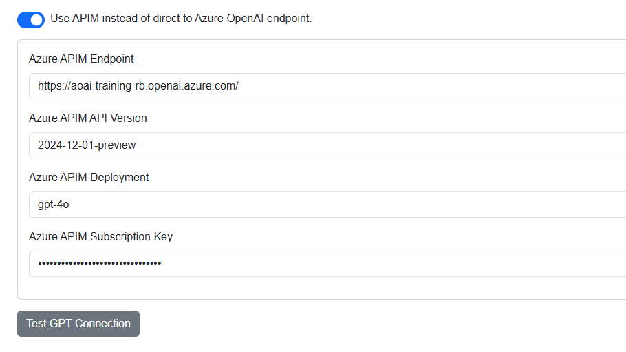

## Usage

> <a href="#simple-chat" style="text-decoration: none;">Return to top</a>

1. **Login**: Access the application URL. You will be redirected to Azure AD for authentication. Log in with an assigned organizational account.
2. **Start Chat**: Begin typing a message in the input box or select a pre-defined prompt to start a new conversation.
3. **Manage Documents (Workspaces)**:
   - Navigate to **Your Workspace** to upload/manage personal documents.
   - Navigate to **My Groups** to create, join, or manage groups and their shared documents (if enabled).
   - Uploaded documents are processed (chunked, embedded) and indexed in Azure AI Search (simplechat-user-index for personal, simplechat-group-index for group).
4. **Enable RAG (Search Documents)**: In the chat interface, toggle the **Search Documents** switch on. This instructs the backend to perform a hybrid search against your accessible indexes (personal and/or active group) based on your message, retrieve relevant chunks, and provide them as context to the AI model.
5. **Upload Ephemeral Documents**: During a conversation, use the attachment/upload icon to upload files **for that specific chat session only**. These are *not* indexed in Azure AI Search and are only available for the duration of the current conversation turn or session (depending on implementation).
6. **Use Bing Web Search** *(Optional)*: If enabled by the admin, toggle the **Search the Web** switch on to augment AI responses with real-time information from Bing.
7. **Generate Images** *(Optional)*: If enabled by the admin, select the "Image" mode or use a specific command (depending on UI implementation) to provide a prompt for image generation via Azure OpenAI DALL-E.
8. **Manage Groups** *(Optional)*: If enabled, use the **My Groups** section to:
   - Create new groups (requires `CreateGroups` role if RBAC is enforced).
   - Join existing groups (based on group visibility/membership settings).
   - Select an **Active Group** from the dropdown. When a group is active, the "Search Documents" toggle will include that group's index (simplechat-group-index) in the search scope, and documents uploaded will be associated with that group.
9. **Review History**: Access previous conversations stored in your history list (typically docked on the left).

### User Workflow Summary

1. **Login**: Authenticate via Azure AD; role (User, Admin, etc.) is determined.
2. **Select Context (Optional)**:
   - Choose an **Active Group** if collaborating.
   - Toggle **Search Documents** on/off for RAG.
   - Toggle **Search the Web** on/off for Bing results.
3. **Interact**:
   - Type messages to chat directly with the AI or trigger RAG/Web search.
   - Upload **ephemeral documents** for single-session context.
   - Use **Workspace/Group** features to manage persistent documents for long-term RAG.
   - Use **Image Generation** mode if needed.
4. **Review**: Access past conversations from history. Provide feedback on responses if enabled.

Okay, here is a new section dedicated to scaling the various components of the Simple Chat application, incorporating the details you provided and best practices for the other services.

## Scaling the Application

> <a href="#simple-chat" style="text-decoration: none;">Return to top</a>

**General Scaling Principle:** Monitor key performance metrics (CPU/memory utilization, request latency, queue lengths, RU consumption, query latency, rate limit responses) for all services using **Azure Monitor** and **Application Insights**. Use these metrics to make informed decisions about when and how to scale each component.

As user load, data volume, or feature usage increases, you will need to scale the underlying Azure resources to maintain performance and availability. Here’s a breakdown of scaling strategies for the key components:

### Azure App Service

> <a href="#simple-chat" style="text-decoration: none;">Return to top</a>

The App Service hosts the Python backend application.

*   **Vertical Scaling (Scale Up):**
    *   **What:** Increasing the resources (CPU, RAM, Storage) allocated to each instance running your application.
    *   **How:** Change the App Service Plan pricing tier (e.g., move from P0v3 to P1v3, P2v3, etc.).
    *   **When:** Useful if individual requests are resource-intensive or if a single instance needs more power to handle its share of the load.
    *   **Simple Chat Support:** **Supported.** The application benefits directly from more powerful instances.

*   **Horizontal Scaling (Scale Out):**
    *   **What:** Increasing the number of instances running your application. Traffic is load-balanced across these instances.
    *   **How:** Adjust the "Instance count" slider in the App Service Plan's "Scale out (App Service plan)" settings, or configure Autoscale rules based on metrics (CPU percentage, memory usage, request queue length).
    *   **When:** Essential for handling higher numbers of concurrent users and improving availability.
    *   **Simple Chat Support:** **Currently Limited / Requires Future Update.**
        *   **Limitation:** The current authentication mechanism stores the user's MSAL session token cache within the local file system of the specific App Service instance that handled the login. If you scale out to multiple instances, subsequent requests from the same user might be routed to a *different* instance that doesn't have the cached token, leading to authentication failures or requiring re-authentication.
        *   **Future Enhancement (Roadmap Phase 1):** Full horizontal scaling support requires:
            1.  Modifying the authentication token caching logic to use a distributed cache.
            2.  Introducing **Azure Cache for Redis** as a central, shared store for session tokens, accessible by all instances.
            3.  Potentially updating Admin Settings to reflect or configure scaling-related behaviors.
            4.  [Prioritized backlog · Simple Chat feature release](https://github.com/orgs/microsoft/projects/1758)
                1.  [Infinite Login Loop with Multi-Instance Scaling · Issue #115 · microsoft/simplechat](https://github.com/microsoft/simplechat/issues/115)
        *   Until this update, rely primarily on **Vertical Scaling** for performance improvements.

### Azure Cosmos DB

> <a href="#simple-chat" style="text-decoration: none;">Return to top</a>

Cosmos DB stores metadata, conversations, settings, etc. Scaling focuses on Request Units per second (RU/s) and global distribution.

*   **Throughput Scaling (RU/s):**
    *   **Autoscale:** The recommended approach. You set a *maximum* RU/s value, and Cosmos DB automatically scales the provisioned throughput between 10% and 100% of that maximum based on real-time usage. This helps manage costs while ensuring performance.
    *   **Database vs. Container Throughput:** You can set Autoscale throughput at the database level (shared by all containers) or, preferably, at the **individual container level**.
    *   **Recommendations:**
        *   Set **Max throughput** at the database level initially (e.g., 1000 RU/s) during setup.
        *   **Configure Container-Level Autoscale (Post-Setup):** For optimal performance, set maximum Autoscale RU/s per container. Recommended starting points for key containers:
            *   `messages`: **4000 RU/s** (scales 400-4000 RU/s)
            *   `documents`: **4000 RU/s** (scales 400-4000 RU/s)
            *   `group_documents`: **4000 RU/s** (scales 400-4000 RU/s)
            *   Other containers (`settings`, `feedback`, `archived_conversations`, etc.): Start lower (e.g., **1000 RU/s** max, scaling 100-1000 RU/s) and monitor.
        *   **Monitor:** Continuously monitor RU consumption (using Azure Monitor Metrics) for each container and adjust the maximum Autoscale values as needed to avoid throttling (HTTP 429 errors) while optimizing cost.

    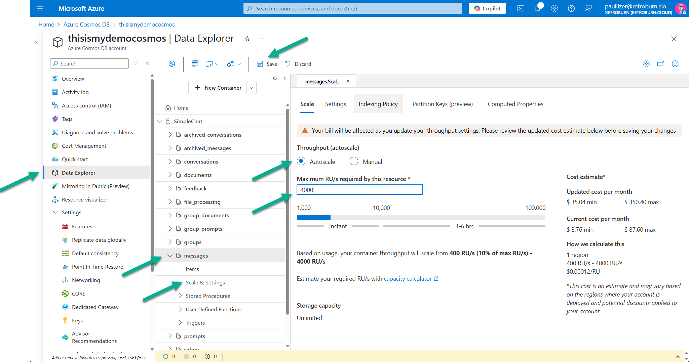

*   **Global Distribution:**
    *   **What:** Replicate your Cosmos DB data across multiple Azure regions.
    *   **Why:** Reduces read/write latency for users in different geographic locations and provides higher availability via regional failover.
    *   **How:** Configure replication in the Azure Cosmos DB portal ("Replicate data globally"). The application *should* automatically connect to the nearest available region, but thorough testing in a multi-region setup is advised. Consider the implications for data consistency levels based on your application's requirements.

### Azure AI Search

> <a href="#simple-chat" style="text-decoration: none;">Return to top</a>

Azure AI Search scaling involves adjusting replicas, partitions, and the service tier.

*   **Replicas (Horizontal Query Scaling):**
    *   **What:** Copies of your index that handle query requests in parallel.
    *   **Why:** Increase query throughput (Queries Per Second - QPS) and improve high availability (queries can be served even if one replica is down).
    *   **How:** Increase the "Replica count" on the AI Search service's "Scale" blade in the Azure portal. Start with 1 for Dev/Test, consider 2-3 for basic HA in production, and increase based on monitored query latency and QPS under load.

*   **Partitions (Data & Indexing Scaling):**
    *   **What:** Shards that store distinct portions of your index. More partitions distribute the index storage and allow for faster parallel indexing.
    *   **Why:** Increase the total amount of data the index can hold and potentially speed up document ingestion/indexing.
    *   **How:** Increase the "Partition count" on the "Scale" blade. **Important:** You generally need to decide on the partition count based on anticipated data volume *before* significant data is indexed, as changing partitions often requires re-indexing. The S1 tier supports up to 12 partitions.

*   **Service Tier (Vertical Scaling):**
    *   **What:** Changing the overall service tier (e.g., Basic, S1, S2, S3, L1, L2).
    *   **Why:** Higher tiers offer increased limits on storage per partition, total storage, maximum replicas/partitions, Semantic Ranker usage, and other features.
    *   **How:** Select a different pricing tier on the "Scale" blade. The recommended starting point is S1. Scale up to S2/S3/L-tiers if you hit the fundamental limits of S1 or require features only available in higher tiers.

### Azure AI / Cognitive Services (OpenAI, Document Intelligence, etc.)

> <a href="#simple-chat" style="text-decoration: none;">Return to top</a>

Services like Azure OpenAI, Document Intelligence, Content Safety, Speech Service, and Video Indexer are typically consumed via API calls and often have rate limits (e.g., Tokens Per Minute/Requests Per Minute for OpenAI, Transactions Per Second for others).

*   **Rate Limits & Quotas:** Be aware of the default limits for your service tiers and regions. Monitor usage and request quota increases via Azure support if necessary.
*   **Azure API Management (APIM) - Recommended Pattern:**
    *   **What:** An Azure service that acts as a gateway or facade for your backend APIs, including Azure AI services.
    *   **Why for Scaling:**
        *   **Load Balancing:** Distribute requests across multiple Azure OpenAI deployments (e.g., different instances, regions, or even different models if abstracted).
        *   **Throttling/Rate Limiting:** Implement custom rate limits in APIM *before* hitting the backend service limits.
        *   **Retry Policies:** Configure automatic retries for transient errors (like HTTP 429 Too Many Requests).
        *   **Centralized Management:** Provides a single point for security, monitoring, and policy enforcement.
    *   **How:**
        1.  Deploy an Azure API Management instance.
        2.  Configure APIM to route requests to your specific Azure AI service endpoints. Implement policies for load balancing, retries, rate limiting, etc.
        3.  **Reference:** For detailed patterns, especially for Azure OpenAI, refer to the guidance and examples provided in the **[AzureOpenAI-with-APIM GitHub repository](https://github.com/microsoft/AzureOpenAI-with-APIM)**. This repository demonstrates robust methods for load balancing and scaling Azure OpenAI consumption.
        4.  **Simple Chat Integration:** Configure the **Admin Settings** within Simple Chat to point to your **APIM Gateway URL** and use your **APIM Subscription Key** for authentication, instead of directly using the backend service endpoint and key. The UI supports APIM configuration for Azure OpenAI (GPT, Embeddings, Image Gen), Content Safety, Document Intelligence, and AI Search.

## Table of Contents 

> <a href="#simple-chat" style="text-decoration: none;">Return to top</a>

- [Overview](#overview)
- [Features](#features)
  - [Why Enable Optional Features?](#why-enable-optional-features)
    - [Content Safety](#content-safety)
    - [Your Workspaces](#your-workspaces)
    - [My Groups (includes Group Workspaces)](#my-groups-includes-group-workspaces)
    - [User Feedback](#user-feedback)
    - [Conversation Archiving](#conversation-archiving)
    - [Video Extraction (Video Indexer)](#video-extraction-video-indexer)
    - [Audio Extraction (Speech Service)](#audio-extraction-speech-service)
    - [Document Classification](#document-classification)
    - [Enhanced Citation (Storage Account)](#enhanced-citation-storage-account)
    - [Metadata Extraction](#metadata-extraction)
    - [File Processing Logs](#file-processing-logs)
- [Roadmap](#roadmap)
- [Latest Features](#latest-features)
  - [(v0.212.78)](#v021278)
    - [New Features](#new-features)
    - [Bug Fixes](#bug-fixes)
- [Release Notes](#release-notes)
- [Demos](#demos)
  - [Upload document and review metadata](#upload-document-and-review-metadata)
  - [Classify document and chat with document](#classify-document-and-chat-with-document)
- [Detailed Workflows](#detailed-workflows)
  - [Content Safety](#content-safety-1)
  - [Add your data (RAG Ingestion)](#add-your-data-rag-ingestion)
- [Prerequisites](#prerequisites)
- [Setup Instructions](#setup-instructions)
  - [Provision Azure Resources](#provision-azure-resources)
  - [Application-Specific Configuration Steps](#application-specific-configuration-steps)
    - [Setting Up Authentication (Azure AD / Entra ID)](#setting-up-authentication-azure-ad--entra-id)
    - [Grant App Registration Access to Azure OpenAI (for Model Fetching)](#grant-app-registration-access-to-azure-openai-for-model-fetching)
    - [Clone the Repository](#clone-the-repository)
    - [Configure Environment Variables (.env File)](#configure-environment-variables-env-file)
    - [Alternate Method: Update App Settings via JSON (Advanced)](#alternate-method-update-app-settings-via-json-advanced)
    - [Initializing Indexes in Azure AI Search](#initializing-indexes-in-azure-ai-search)
  - [Installing and Deploying the Application Code](#installing-and-deploying-the-application-code)
    - [Deploying via VS Code (Recommended for Simplicity)](#deploying-via-vs-code-recommended-for-simplicity)
    - [Deploying via Azure CLI (Zip Deploy)](#deploying-via-azure-cli-zip-deploy)
  - [Running the Application](#running-the-application)
  - [Upgrading the Application](#upgrading-the-application)
    - [Using Deployment Slots (Recommended for Production/Staging)](#using-deployment-slots-recommended-for-productionstaging)
    - [Using Direct Deployment to Production (Simpler, for Dev/Test or Low Impact Changes)](#using-direct-deployment-to-production-simpler-for-devtest-or-low-impact-changes)
    - [Automate via CI/CD](#automate-via-cicd)
  - [Admin Settings Configuration](#admin-settings-configuration)
  - [Azure Government Configuration](#azure-government-configuration)
  - [How to use Managed Identity](#how-to-use-managed-identity)
- [FAQ](#faq)
- [Usage](#usage)
  - [User Workflow Summary](#user-workflow-summary)
- [Scaling the Application](#scaling-the-application)
  - [Azure App Service](#azure-app-service)
  - [Azure Cosmos DB](#azure-cosmos-db)
  - [Azure AI Search](#azure-ai-search)
  - [Azure AI / Cognitive Services (OpenAI, Document Intelligence, etc.)](#azure-ai--cognitive-services-openai-document-intelligence-etc)

<!-- END REVISED README.MD BLOCK -->