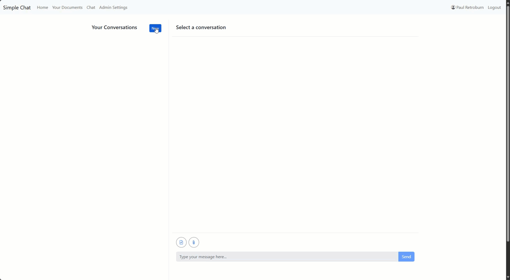

<!-- BEGIN README.MD BLOCK -->

# Simple Chat Application

## Overview

The **Simple Chat Application** is designed to enable users to interact with a generative AI model via a web-based chat interface. It supports **Retrieval-Augmented Generation (RAG)**, allowing users to enhance the AI’s responses with custom data by uploading documents. The application uses **inline temporary file storage** for short-term processing and **Azure AI Search** for long-term document retrieval and storage, enabling efficient hybrid searches. The application is built to run on **Azure App Service** both in **Azure Commercial** and **Azure Government**.

https://github.com/user-attachments/assets/a1045817-e2e4-4336-8a18-d4f83a6a02af


## Features

- **Chat with AI**: Interact with an AI model based on OpenAI's GPT.
- **RAG with Hybrid Search**: Upload documents and perform hybrid searches, retrieving relevant information from your files.
- **Document Management**: Upload, store, and manage multiple versions of documents (personal or group-level).
- **Group Management**: Create and join groups to share access to group-specific documents (RBAC).
- **Ephemeral (Single-Convo) Documents**: Upload temporary documents available only during the current chat session.
- **Azure Cosmos DB**: Stores conversations, documents, and metadata.
- **Azure Cognitive Search**: Facilitates efficient search and retrieval of document data.
- **Azure Document Intelligence**: Extracts data from various document formats, including PDFs, Word documents, and images.
- **Optional Content Safety**: Toggle content safety to analyze all user messages before they are sent to any service. Provides access to Admin and User specific Safety Violation pages.
- **Optional Feedback System**: Toggle feedback for users to submit feedback on AI generated content. Provide access to Admin and user specific Feedback pages.
- **Optional Bing Web Search**: Toggle web-search-based augmentation from the Admin Settings.  
- **Optional Image Generation**: Toggle image generation with Azure OpenAI from the Admin Settings.
- **Authentication & RBAC**: Secured via Azure Active Directory (AAD) integration, using MSAL (Microsoft Authentication Library), managed identities, plus group-based access control and app roles.
- **Supported filetypes**: 'txt', 'pdf', 'docx', 'xlsx', 'xls', 'csv', 'pptx', 'html', 'jpg', 'jpeg', 'png', 'bmp', 'tiff', 'tif', 'heif', 'md', 'json'


### Why Enable Optional Features?

#### **Content Safety**

Ensures governance and security by reviewing all user messages before they interact with any service, including AI models, document search, web search, and image generation. This feature allows organizations to enforce custom filters and compliance policies, mitigating risks while maintaining a safe and controlled user experience.

- **Prevents inappropriate content** from being processed or retrieved.
- **Compliance** with organizational policies and governance.
- **Enhances security** by filtering queries before they interact with external systems or AI models.

#### **Your Workspaces**

**Your Workspace** makes working with **Azure OpenAI** more powerful by keeping all your important docs and prompts in one spot—no more copy-pasting or hunting for files. Whether you're summarizing reports, drafting emails, or brainstorming ideas, the AI can pull from your stored content, giving you smarter, more relevant responses instantly.

- **All-in-one hub** for personal documents and prompts, making them easy to find and use.
- **Better AI context** by letting Azure OpenAI “see” your stored documents for more accurate and tailored responses.
- **Time-saver** since you won’t need to repeatedly upload or copy-paste crucial information—everything is stored once, used often.

#### **My Groups (includes Group Workspaces)**

Provide a way for teams to share docs and prompts so everyone’s on the same page. Instead of re-explaining things or sending endless email chains, your whole team can tap into the same knowledge base and get consistent AI-driven answers—perfect for teams who want to move fast, stay aligned, and get the most out of AI without the usual hassle.

- **Shared knowledge base** that keeps everyone aligned with the same up-to-date resources.
- **Effortless collaboration** on documents and prompts, reducing repetitive tasks and email back-and-forth.
- **Consistent AI responses** because the entire group references identical data and prompt sets, minimizing misinformation.

## Latest Features 

Below is a suggested “What’s New” or “Latest Features” section you can add to your README (or Release Notes) based on the diffs provided. Feel free to adjust the version number, headings, or wording to match your project’s style.

### (v0.203.15)

The update introduces "Workspaces," allowing users and groups to store both **documents** and **custom prompts** in a shared context. A new **prompt selection** feature enhances the chat workflow for a smoother experience. Additionally, admin configuration has been streamlined, and the landing page editor now supports improved Markdown formatting.

#### 1. Renaming Documents to Workspaces

- **Your Documents** → **Your Workspace**
- **Group Documents** → **Group Workspaces**
- All references, routes, and templates updated (`documents.html` → `workspace.html`, `group_documents.html` → `group_workspaces.html`).
- New admin settings flags: `enable_user_workspace` and `enable_group_workspaces` replaced the old `enable_user_documents` / `enable_group_documents`.

#### 2. Custom Prompt Support

- User Prompts:
  - New backend routes in `route_backend_prompts.py` (CRUD for user-specific prompts).
- Group Prompts:
  - New backend routes in `route_backend_group_prompts.py` (CRUD for group-shared prompts).

#### 3. Chat Page Enhancements

- Prompt Selection Dropdown:
  - New button (“Prompts”) toggles a dropdown for selecting saved user/group prompts.
  - Eliminates copy-paste; helps users insert larger or more complex prompts quickly.
  - Lays groundwork for future workflow automation.
- **Toast Notifications** for errors and status messages (replacing browser alerts).

#### 4. Cosmos Containers

- Added `prompts_container` and `group_prompts_container`.
- **Simplified** or standardized the container creation logic in `config.py`.

#### 5. Updated Deployment and Configuration Instructions

- BIG UPDATE on deployment and configuration instructions, added significant details on order, app registration, configuration, managed identity, azure environment, service SKU, a deployment video, and more!

## Release Notes

For a detailed list of features released by version, please refer to the [Release Notes](./RELEASE_NOTES.md).

## Demos

### Upload Document


### Chat with Searching your Documents


### Chat with temporary documents in a single conversation



## Detailed Workflows

### Content Safety


1. **Content Safety Interrogation**
   - When enabled, **Content Safety** reviews any message sent by a user **before** it reaches any service in Simple Chat.
   - It acts as a **governance and security layer** that sits in front of all services.
2. **Web Search Interrogation**
   - If **Bing web search** is enabled, **Content Safety** examines the user’s query **before** it is sent to the internet.
   - This allows for **custom filters and category controls** to align with an organization's risk and compliance requirements.
3. **Retrieval-Augmented Generation (RAG) & AI Search Interrogation**
   - Before a question is sent to **RAG** or **Azure AI Search** to search personal or group document indexes, it is first inspected by **Content Safety**.
4. **Direct Model Interaction Review**
   - If a user interacts **directly** with an AI model (without searching documents or the web), the message is still interrogated first.
5. **Image Generation Review**
   - Before an image is generated, the request is reviewed for compliance and safety.

### Add your data 

Add your data use the Documents feature in Your Workspace and Group Workspaces by providing a RAG based approach for using your data as a source of information to improve your use of AI.


1. **User Uploads a File**

   - Supported file types are listed in the README (e.g., Office documents).
   - The file is uploaded through the **SimpleChat** application.

2. **File is Sent to Document Intelligence**

   - Document Intelligence reads the file.
   - It extracts all text and content from the document.

3. **Content is Chunked**

   - The extracted text is divided into chunks of **2,000 characters** with a **500-character overlap**.

4. **Vectorization (Embedding) of Data**

   - Each chunk is sent to the **embedding model** in the **Azure OpenAI endpoint**.
   - The model generates a **numerical representation (embedding)** for the chunk.
   - This process repeats until all content from the file is processed.

5. **Storage in Azure AI Search and Cosmos**

   - The following information is stored in 

     Azure AI Search Index:

     - Chunk content
     - Embeddings
     - Metadata (e.g., parent document, page number, chunk number, version, date, user ID)

   - Additional metadata, including the number of chunks and other related data, is stored in **Cosmos DB**.

   - Cosmos maintains a **relationship between the AI search chunks and the parent document**.

6. **User Searches for Data**

   - Users can click **"Search Your Data"** to retrieve stored content.
   - Options for searching:
     - Search all personal documents.
     - Search all group documents (if group functionality is enabled).
     - Search both personal and group documents simultaneously.
     - Search within a specific document in **personal** or **group workspaces**.

## Setup Instructions

### Provision Azure Resources

For a quick estimate of monthly costs based on our recommended baseline SKUs for a Demo/POV/MVP solution, check out the [Azure Pricing Calculator](https://azure.com/e/11e3a66700924f248722186c089b275c). Below are the services and SKUs reflected in that link:

> [!IMPORTANT]
>
> The following recommended SKUS are for Development/Demo/POC/MVP. You will need to scale services appropriately as you increase user counts or move into Production

| Service Type           | Description                                                  |
| ---------------------- | ------------------------------------------------------------ |
| Front End App Service  | Basic Tier; 1 B1 (1 Core(s), 1.75 GB RAM, 10 GB Storage) x 730 Hours; Windows OS; 0 SNI SSL Connections; 0 IP SSL Connections; 0 Custom Domains; 0 Standard SLL Certificates; 0 Wildcard SSL Certificates |
| Azure OpenAI GPT Model | Language Models, Standard (On-Demand), GPT-4o US/EU Data Zones, 10,000 x 1,000 input tokens, 3,000 x 1,000 output tokens |
| Azure OpenAI Embedding | Embedding Models, Text-Embedding-3-Small, 1,000,000 x 1,000 Tokens |
| Azure OpenAI Image Gen | Image Models, Dall-E-3, 1 x 100 Standard 1024 x 1024 images, 1 x 100 Standard 1024 x 1792 images, 1 x 100 HD 1024 x 1024 images, 1 x 100 HD 1024 x 1792 images |
| Azure AI Search        | Standard S1, 1 Unit(s), 360 Hours, 10K semantic queries      |
| Content Safety         | Azure AI Content Safety, Standard: 10 x 1,000 text records and 1 x 1,000 images included per month |
| Document Intelligence  | Azure Form Recognizer, Pay as you go, S0: 0 x 1,000 Custom pages, 1 x 1,000 Pre-built pages, 1 x 1,000 Read pages, 1 x 1,000 Add-on pages, 1 x 1,000 Query pages |
| Bing Search            | Bing Search, S1 tier: 1,000 transactions                     |
| Azure Cosmos DB        | Azure Cosmos DB for NoSQL (RU), Autoscale provisioned throughput, Always-free quantity disabled, Pay as you go, Single Region Write (Single-Master) - East US (Write Region), 1,000 RU/s x 730 Hours x 30% Avg Utilization x 1.5 Autoscale factor, 100 GB transactional storage, Analytical storage disabled, 2 copies of periodic backup storage |

> **Note**: Pricing is subject to change and may vary based on your usage, region, and specific configuration. Always confirm with the official Azure Pricing Calculator and your Azure subscription details for the most accurate cost estimates.

1. **Create or Select a Resource Group**  
   - It’s often easiest to group all resources together under one Azure Resource Group (e.g., `rg-simple-chat`).  
   - For best performance, match regions as shown above (e.g., `East US` for Azure OpenAI, `West US` for App Service) or adjust to your local region needs.
2. **Deploy App Service**  
   - Create an **Azure App Service**: 
     - Publish = **Code**
     - Operating system = **Linux**
     - Linux Plan = Use **P0v3**
     - Zone redundancy = **Disabled**
   - After creation, note the **App Name** and **URL** (e.g., `https://my-simplechat-app.azurewebsites.net`).
3. **Deploy Azure OpenAI**  
   - You can deploy a single endpoint or you can deploy separate endpoints for GPT, Embedding, and Image Generation.
   - Create a **Standard S0**. 
   - Deploy one or more **Azure OpenAI** resources in whichever region best supports your requirements.
   - Deploy the necessary models 
     - **GPT** model (`gpt-4o` but you can use any GPT or o level model).
       - This is required for all services.
     - **Embedding** model (`text-embedding-3-small`)
       - This is required if you enable **Your Workspace** or **My Groups (includes Group Workspaces)**
     - **Image Generation** (`DALL-E 3`). 
       - This is required if you enable **Image Generation**.
   - If using **Managed Identity**, make sure to assign the App Service the correct role in your Azure OpenAI resource.
4. **Deploy Azure AI Search**  
   - Create a **Standard S1**.  
   - [Initialize indexes](#initializing-indexes-in-azure-ai-search) (personal and group).
   - If using **Managed Identity**, make sure to assign the App Service the correct role in your Azure OpenAI resource.
5. **Deploy Azure Cosmos DB**  
   - Use **Azure Cosmos DB for NoSQL** with RU-based autoscale (1,000 RU/s)
     - Provisioned throughput.
     - DO NOT APPLY free discount tier (it does not have enough throughput).
     - Uncheck (aka DISABLE) limit total account throughput.
   - Optionally, set up **Managed Identity** authentication if you do not want to store keys.
6. **Deploy Azure AI Document Intelligence**
   1. Create a **Standard S0**.  
   2. If using **Managed Identity**, make sure to assign the App Service the correct role in your Azure OpenAI resource.

7. **Deploy Azure AI Content Safety** (optional)  
   1. Create a **Standard S0**.  
   2. If using **Managed Identity**, make sure to assign the App Service the correct role in your Azure OpenAI resource.

8. **Deploy Bing Search** (optional)  
   1. Create a **Standard S1**.  
   2. Provide that **Bing Search** key in the **App Settings**.

### Proceed with Application-Specific Configuration

Now that all of your services are deployed, please perform the following steps in order. 

### Setting Up Authentication for the Simple Chat Application

The application secures access using **Azure Active Directory**. Users log in with their organizational credentials. Access is further refined with roles (`Owner`, `Admin`, `DocumentManager`, `User`) assigned in your tenant’s **Enterprise Applications**.

1. **Enable App Service Authentication**  
   - In the **App Service** → **Authentication** blade, add **Microsoft** as an identity provider, linking to your Azure AD app registration.  
   - Require authentication so only logged-in users can access the app.

2. **App Registration**  
   - In **Azure AD** → **App Registrations**, find your registration (e.g., `my-webapp-simplechat`).  
   - Configure Redirect URIs (e.g., `https://my-webapp.azurewebsites.net/getAToken`) and permissions.  
   - Grant admin consent if needed (e.g., `User.Read`, `User.ReadBasic.All`, etc.).

3. **Assign Users in Enterprise Applications**  
   - Under **Enterprise Applications** → **Users and groups**, assign users or groups to the app, specifying the appropriate role.

### Configured Permissions

Your application is authorized to call APIs when granted permissions by users or administrators. Below are the currently configured permissions for **Microsoft Graph** in this application.

> [!WARNING]
>
> If you plan on enabling My Groups (includes Group Workspaces), then you NEED to Grant Admin Consent for **People.Read.All** as a permission, this is what is used by the application to find users in your Entra tenant.

| API / Permission Name  | Type      | Description                                         |
| ---------------------- | --------- | --------------------------------------------------- |
| **email**              | Delegated | View users' email address                           |
| **offline_access**     | Delegated | Maintain access to data you have given it access to |
| **openid**             | Delegated | Sign users in                                       |
| **People.Read.All**    | Delegated | Read all users' relevant people lists               |
| **profile**            | Delegated | View users' basic profile                           |
| **User.Read**          | Delegated | Sign in and read user profile                       |
| **User.ReadBasic.All** | Delegated | Read all users' basic profiles                      |

### Granting Admin Consent

For the permissions that require **admin consent**, ensure that an administrator grants consent by:

1. Navigating to **Azure Portal > Azure Active Directory**.
2. Selecting **App registrations** and locating your registered application.
3. Clicking on **API permissions**.
4. Selecting **Grant admin consent for [your tenant]**.
5. Confirming the operation.

### Adding Additional Permissions

If your application requires further permissions:

1. Click **+ Add a permission**.
2. Select **Microsoft Graph** or another API.
3. Choose either **Delegated permissions** (acting on behalf of the user) or **Application permissions** (acting as a service).
4. Select the required permissions and **Add** them.
5. If admin consent is required, follow the **Granting Admin Consent** steps above.

By ensuring the correct permissions and admin consent, your application can securely interact with Microsoft Graph APIs while respecting user and security policies.

### App Roles

**Description**: App roles are custom roles to assign permissions to users or apps. The application defines and publishes these app roles, which are then interpreted as permissions during authorization.

| Display Name | Description            | Allowed Member Types | Value | State   |
| ------------ | ---------------------- | -------------------- | ----- | ------- |
| **Admins**   | Manage the application | Users/Groups         | Admin | Enabled |
| **Users**    | Normal user            | Users/Groups         | User  | Enabled |

### Adding Users to the Application

To allow users to sign in to your application and automatically be assigned the correct role (Admin or User), you must add these users in the **Enterprise application** that is associated with your **Registered app** in Azure Active Directory:

1. **Go to Azure Active Directory**  
   - In the [Azure Portal](https://portal.azure.com), go to **Azure Active Directory** from the main menu.

2. **Select ‘Enterprise applications’**  
   - Under the **Manage** section in Azure AD, choose **Enterprise applications**.

3. **Locate Your Application**  
   - Find and select the Enterprise application that was automatically created when you registered your app (the name should match or be closely related to the registered app’s name).

4. **Go to ‘Users and groups’**  
   - Under **Manage** for that Enterprise application, select **Users and groups** to manage role assignments.

5. **Click on ‘Add user/group’**  
   - Here, you can choose to add either **individual users** or entire **Azure AD groups** to the application.

6. **Assign the Appropriate Role**  
   - When adding users or groups, you will see the available app roles (e.g., **Admins**, **Users**).  
   - Select the relevant role to ensure the user or group is granted the correct permissions.

7. **Save Your Changes**  
   - Confirm your assignments and click **Assign** (or **Save**) to finalize.

8. **Verification**  
   - Once a user is assigned, they can sign in and be granted the permissions associated with their role in your application.

### Assign App Registration Role

You need to assign the Registered application the Cognitive Services OpenAI User role on your Azure OpenAI endpoint(s). This allows the application to fetch/pull the models from the GPT, Embedding, and Image Generation endpoints.

1. Go to each **Azure OpenAI** service you are using

2. Select **Access Control (IAM)**

3. Select **+ Add**

4. Select **Add role assignment**

5. Search for and select **Cognitive Services OpenAI User**

   

6. Select **Next**

7. Select **User, group, or service principal**

8. Select **+ Select members**

9. Search for and select the Registered App created in [Setting Up Authentication for the Simple Chat Application](#Setting Up Authentication for the Simple Chat Application)

   

10. Select **Next**

11. Select **Review + assign**

### **Clone the Repo**

To proceed you need to clone the repo so you have a local copy of the application code.

1. You can select **Open it GitHub Desktop**
2. You can Download ZIP
   1. Then you extract the zip
3. You can use the **GitHub CLI**
4. Then you open it in **VS Code**


### Configuring Environment Variables and `.env` File

While **Azure OpenAI** (GPT, Embeddings, Image Gen) and **Bing Search** are now configured via the in-app **Admin Settings**, you still need some basic environment variables for the rest of the services. These are typically set in the Azure Portal under **Configuration** or uploaded via a `.env` file.

```env
# Azure Cosmos DB
AZURE_COSMOS_ENDPOINT="<your-cosmosdb-endpoint>"
AZURE_COSMOS_KEY="<your-cosmosdb-key>"
AZURE_COSMOS_AUTHENTICATION_TYPE="key" # key or managed_identity

# Azure Bing Search
BING_SEARCH_ENDPOINT="https://api.bing.microsoft.com/"

# Azure AD Authentication
CLIENT_ID="<your-client-id>"
TENANT_ID="<your-tenant-id>"
AZURE_ENVIRONMENT="public" #public, usgovernment
SECRET_KEY="32-characters" # Example - "YouSh0uldGener8teYour0wnSecr3tKey!"
```

1. **Modify `example.env`**  
   - Rename `example.env` to `.env`.  
   - Update placeholders for **Azure Cosmos DB**, **AAD**, **Azure Environment**, and **Secret Key** values.  
2. **Upload `.env` to Azure App Service**  
   - If you have  `.env` file open, please close it.
   - In VS Code, you have a few options
     - Press control + shift + p, search for **Azure App Service: Upload Local Settings** 
       - 
     - (1) Right click on  `.env` file and (2) select **Upload Local Settings**
       - 
3. **Download  `.env` from Azure App Service**
   - In VS Code
     - Press control + shift + p, search for **Azure App Service: Download Remote Settings**
     - 
   - This will upload your local  `.env` file, now you can open it and you will see additional properties.

#### Alternate Method: Upload Environment Variables Using JSON Configuration

If you prefer, you can update your environment variables directly in the Azure Portal using the **Advanced Edit** feature. This method allows you to paste a JSON configuration, which can be especially useful for bulk updates or when setting up a new environment.

#### Steps:

1. Navigate to your **App Service** in the [Azure Portal](https://portal.azure.com/).
2. Go to **Settings** > **Environment Variables**.
3. Click on the **App settings** tab.
4. Save the values for
   1. `MICROSOFT_PROVIDER_AUTHENTICATION_SECRET`
   2. `APPLICATIONINSIGHTS_CONNECTION_STRING`
   3. `WEBSITE_AUTH_AAD_ALLOWED_TENANTS`
5. Update the JSON configuration below with 
   1. `MICROSOFT_PROVIDER_AUTHENTICATION_SECRET`
   2. `SECRET_KEY`
   3. `APPLICATIONINSIGHTS_CONNECTION_STRING`
   4. `AZURE_COSMOS_ENDPOINT`
   5. `AZURE_COSMOS_KEY`
   6. `AZURE_COSMOS_AUTHENTICATION_TYPE`
   7. `CLIENT_ID`
   8. `TENANT_ID`,
   9. `WEBSITE_AUTH_AAD_ALLOWED_TENANTS`
6. Then Click **Advanced edit**.
7. Copy and paste the JSON into the **Advanced Edit** window.
8. Click **OK**, then **Save** to apply the changes.

#### JSON Configuration:

> [!NOTE]
>
> Replace the placeholder values (e.g., `MICROSOFT_PROVIDER_AUTHENTICATION_SECRET`, `SECRET_KEY`, `APPLICATIONINSIGHTS_CONNECTION_STRING`, `AZURE_COSMOS_ENDPOINT`, `AZURE_COSMOS_KEY`, `AZURE_COSMOS_AUTHENTICATION_TYPE`, `CLIENT_ID`, `TENANT_ID`, `WEBSITE_AUTH_AAD_ALLOWED_TENANTS`) with your actual configuration values.

```json
[
    { "name": "APPLICATIONINSIGHTS_CONNECTION_STRING", "value": "InstrumentationKey=<your-instrumentation-key>;IngestionEndpoint=<your-ingestion-endpoint>;LiveEndpoint=<your-live-endpoint>;ApplicationId=<your-application-id>", "slotSetting": false },
    { "name": "MICROSOFT_PROVIDER_AUTHENTICATION_SECRET", "value": "<your-authentication-secret>", "slotSetting": true },
    { "name": "WEBSITE_AUTH_AAD_ALLOWED_TENANTS", "value": "<your-allowed-tenant-id>", "slotSetting": false },
    { "name": "AZURE_COSMOS_ENDPOINT", "value": "<your-cosmosdb-endpoint>", "slotSetting": false },
    { "name": "AZURE_COSMOS_KEY", "value": "<your-cosmosdb-key>", "slotSetting": false },
    { "name": "AZURE_COSMOS_AUTHENTICATION_TYPE", "value": "key", "slotSetting": false },
    { "name": "CLIENT_ID", "value": "<your-client-id>", "slotSetting": false },
    { "name": "TENANT_ID", "value": "<your-tenant-id>", "slotSetting": false },
    { "name": "SECRET_KEY", "value": "<your-32-character-secret>", "slotSetting": false },
    { "name": "BING_SEARCH_ENDPOINT", "value": "https://api.bing.microsoft.com/", "slotSetting": false },
    { "name": "SCM_DO_BUILD_DURING_DEPLOYMENT", "value": "true", "slotSetting": false },
    { "name": "WEBSITE_HTTPLOGGING_RETENTION_DAYS", "value": "7", "slotSetting": false },
    { "name": "APPINSIGHTS_INSTRUMENTATIONKEY", "value": "<your-instrumentation-key>", "slotSetting": false },
    { "name": "ApplicationInsightsAgent_EXTENSION_VERSION", "value": "~3", "slotSetting": false },
    { "name": "APPLICATIONINSIGHTSAGENT_EXTENSION_ENABLED", "value": "true", "slotSetting": false },
    { "name": "XDT_MicrosoftApplicationInsights_Mode", "value": "default", "slotSetting": false },
    { "name": "APPINSIGHTS_PROFILERFEATURE_VERSION", "value": "1.0.0", "slotSetting": false },
    { "name": "APPINSIGHTS_SNAPSHOTFEATURE_VERSION", "value": "1.0.0", "slotSetting": false },
    { "name": "SnapshotDebugger_EXTENSION_VERSION", "value": "disabled", "slotSetting": false },
    { "name": "InstrumentationEngine_EXTENSION_VERSION", "value": "disabled", "slotSetting": false },
    { "name": "XDT_MicrosoftApplicationInsights_BaseExtensions", "value": "disabled", "slotSetting": false },
    { "name": "XDT_MicrosoftApplicationInsights_PreemptSdk", "value": "disabled", "slotSetting": false }
]
```

#### Notes:

By using the **Advanced Edit** function and pasting this JSON, you can easily manage and update your environment variables in a single step.


### Initializing Indexes in Azure AI Search

The **Simple Chat Application** uses Azure AI Search to store user (personal) and group documents. You’ll create **two** indexes:

1. **User Index**  
2. **Group Index**  

Both schemas are found in the `artifacts/` folder (`user-index.json` and `group-index.json`).

```
     📁 SimpleChat
     └── 📁 artifacts
         └── user-index.json
         └── group-index.json
```

#### Steps to Initialize the Indexes in the Azure Portal

1. **Access the Azure Portal**  
   - Go to the [Azure Portal](https://portal.azure.com/).  
   - In the search bar, search for **"Azure Cognitive Search"** and select your Azure AI Search resource.

2. **Navigate to Indexes**  
   - In the left-hand menu, select **Indexes** under **Search Management**.
   - Click on **+ Add Index from JSON** to create a new index.

3. **Create Index from JSON**  
   - Open `user-index.json` in your local editor. Copy its JSON and paste into the Azure portal’s **Add Index from JSON** screen.  
   - Do the same for `group-index.json`.

4. **Verify Index Creation**  
   - After creation, you should see `simplechat-user-index` and `simplechat-group-index` listed under Indexes.

### Installing and Deploying

#### Deploying via VS Code

1. Install the **Azure Tools** and **Azure App Service** VS Code Extensions.
2. Sign in to your Azure account in VS Code.
3. Right-click on the single_app → **Deploy to Web App**.
4. Select or create an **Azure App Service**.
5. Wait for deployment to complete.
6. Upload your `.env` or configure application settings in the Azure Portal.

### Running the Application

Visit your app service in Azure and select the URL


### **Admin Settings Configuration**

1. **General**: Set the application title, toggle show/hide logo, and customize the landing page text.
2. **GPT**: Provide the Azure OpenAI GPT endpoint, choose between **Key** or **Managed Identity** for authentication, and select your GPT model deployment. Optionally, enable Azure API Management (APIM) instead of connecting directly to OpenAI.
3. **Embeddings**: Provide the Azure OpenAI Embedding endpoint and select the embedding model deployment. Choose between **Key** or **Managed Identity** for authentication and enable APIM if applicable.
4. **Image Generation** (optional): Enable this setting to add an **Image** button in chat for AI-generated images. Configure the Azure OpenAI image generation endpoint, select a model, and set authentication options.
5. **Workspaces**: Enable or disable **personal workspaces** and **group workspaces** for users.
6. **Safety**: Enable **Content Safety Filtering** to analyze user messages, configure the safety endpoint, and set authentication options. Enable **User Feedback** to allow thumbs up/down reactions on AI responses. Optionally, enable **Conversation Archiving** to store deleted conversations instead of permanently removing them.
7. **Search and Extract**: Enable **Bing Web Search** to retrieve real-time web results, configure **Azure AI Search** for knowledge base lookups, and enable **Document Intelligence** to process structured data from documents.
8. **Other**: Set additional limits such as **maximum file upload size**, **conversation history limits**, and the **default system prompt** used for AI responses.


### Azure Government Configuration

Update the `.env` so that `AZURE_ENVIRONMENT` is set to `usgovernment`. This modifies the application so that managed identity use cases and model fetches for direct endpoints for GPT, Embedding, and Image generation can access the management plane.

```env
# Azure Cosmos DB
AZURE_COSMOS_ENDPOINT="<your-cosmosdb-endpoint>"
AZURE_COSMOS_KEY="<your-cosmosdb-key>"
AZURE_COSMOS_AUTHENTICATION_TYPE="key" # key or managed_identity

# Azure Bing Search
BING_SEARCH_ENDPOINT="https://api.bing.microsoft.com/"

# Azure AD Authentication
CLIENT_ID="<your-client-id>"
TENANT_ID="<your-tenant-id>"
AZURE_ENVIRONMENT="usgovernment" #public, usgovernment
SECRET_KEY="32-characters" # Example - "YouSh0uldGener8teYour0wnSecr3tKey!"
```

### How to use Managed Identity

If you want to use Simple Chat's application Managed Identity to authenticate to those Azure services that support it, use the following steps as guidance.

> [!NOTE]
>
> The **App Service Managed Identity** is a system-assigned identity that Azure automatically manages for authentication, eliminating the need for storing credentials. It is primarily used for securely accessing Azure resources without requiring explicit client credentials.
>
> In contrast, an **Application Registration** represents a manually created identity in **Entra** that allows external applications or services to authenticate and request API access using client secrets or certificates. An **Enterprise Application**, on the other hand, is an **instance** of an **Application Registration** that is assigned to a tenant and includes role-based access control (RBAC) and user assignments for single sign-on (SSO) scenarios.
>
> While **Managed Identities** are automatically managed and scoped within Azure for internal service authentication, **Registered Applications** and **Enterprise Applications** require explicit configuration, credential management, and permissions setup for broader authentication scenarios, including third-party integrations.
>
> The Simple Chat app's Service principal needs access to the management plane of Azure OpenAI to fetch models but the applications Managed Identity needs access to the data plane of Azure OpenAI and other Azure services to use the service.

#### Enable Managed Identity

1. Go to your app service

2. Navigate to **Settings**, and select **Identity**

3. Enabled Status by switching it to **On**

4. Select **Save**

   

#### Assign Role to Managed Identity

1. Go to the service you want to use Managed Identity authentication
2. Select **Access Control (IAM)**
3. Select **+ Add**

4. Select **Add role assignment**

5. Search for and select **Cognitive Services OpenAI User**

   

6. Select **Next**

7. Select **Managed Identity**

8. Select **+ Select members**

9. Search for and select the Managed Identity create earlier.

   

10. Select **Next**

11. Select **Review + assign**

Repeat for each service, the following table outlines the role to assign.

| Service               | Role                                          |
| --------------------- | --------------------------------------------- |
| Azure OpenAI          | Cognitive Services OpenAI User                |
| Content Safety        | Cognitive Services Data Contributor (Preview) |
| Document Intelligence | Cognitive Services Data Contributor (Preview) |
| Azure AI Search       | Search Index Data Contributor                 |

## Usage

1. **Login**: Users must log in via Azure Active Directory.

2. **Chat**: Start a conversation with the AI or retrieve previous conversations.

3. Upload Documents

   (Personal or Group):

   - Personal documents are indexed in `simplechat-user-index`.
   - Group documents are indexed in `simplechat-group-index` and only visible to group members.

4. **Toggle Hybrid Search**: Optionally switch on the “Search Documents” button to retrieve context from your docs.

5. **Upload Ephemeral Documents**: Files that live for one conversation only (not in Cognitive Search).

6. **Bing Web Search** (optional): Toggle “Search the Web” for internet augmentation.

7. **Image Generation** (optional): Enable “Image” mode to generate images via Azure OpenAI.

8. Groups

   - Create or join existing groups; each group has an owner and optional admins.
   - Switch to the “active group” to see that group’s documents.

### User Workflow

1. **Login** via Azure AD → The user is assigned a role.
2. **Choose Group**: If applicable, pick or set an active group.
3. **Chat**: Compose messages in the chat UI.
4. **Attach Docs**: Upload personal or group docs to store or ephemeral docs for a single conversation.
5. **Hybrid Search**: Enable searching your personal or group docs for context.
6. **Review Past Chats**: The user can revisit conversation history stored in Azure Cosmos DB.
